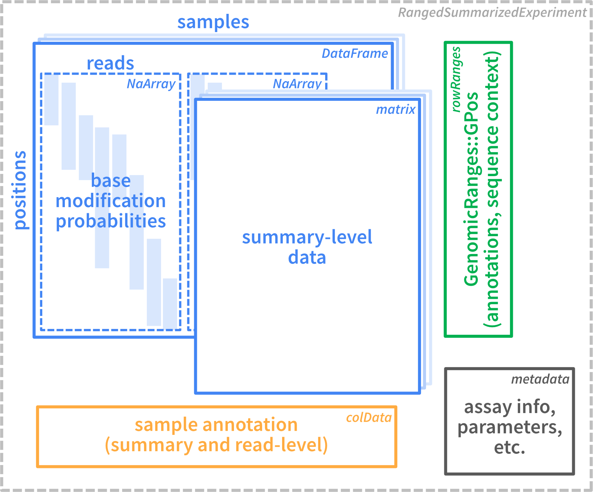

# SingleMoleculeGenomicsIO

## Overview

`SingleMoleculeGenomicsIO` provides tools for reading and processing
single-molecule genomics data in R. These include functions for reading
base modifications from `modBam` files (standard bam files with
modification data stored in `MM` and `ML` tags, see
[SAMtags.pdf](https://samtools.github.io/hts-specs/SAMtags.pdf)),
e.g. generated from Oxford Nanopore or PacBio data using tools like
[Dorado](https://github.com/nanoporetech/dorado) or equivalent, from
text files generated by [modkit](https://nanoporetech.github.io/modkit),
or from `bam` files where modification information is encoded via
sequence mismatches (e.g., resulting from bisulfite sequencing or
deamination-based protocols). The package also provides an efficient
representation of such data as R objects (based on the widely used
`SummarizedExperiment` class), and functions to manipulate and summarize
such objects. `SingleMoleculeGenomicsIO` does not provide functions for
downstream analyses (e.g. differential footprint identification or
nucleosome analyses), or visualization. Such functionality can for
example be found in
[footprintR](https://fmicompbio.github.io/footprintR/) or
[nomeR](https://github.com/fmi-basel/compbio-nomeR).

In this vignette, we will focus on reading data from these different
formats and outline how to process the obtained data, e.g. to filter out
low-quality reads, subset to specific sequence contexts, or regroup the
reads according to some annotation of interest.

Current contributors include:

- [Panagiotis Papasaikas](https://github.com/ppapasaikas)
- [Sebastien Smallwood](https://github.com/smalseba)
- [Charlotte Soneson](https://github.com/csoneson)
- [Michael Stadler](https://github.com/mbstadler)

## Installation

`SingleMoleculeGenomicsIO` can be installed from GitHub via the
`BiocManager` package:

    if (!requireNamespace("BiocManager", quietly = TRUE))
        install.packages("BiocManager")

    BiocManager::install("fmicompbio/SingleMoleculeGenomicsIO")

## Load required packages

``` r
library(SingleMoleculeGenomicsIO)
library(SummarizedExperiment)
library(Biostrings)
library(SparseArray)
library(BiocParallel)
```

## Data representation

The figure below illustrates the basic structure of the data container
used within `SingleMoleculeGenomicsIO`. All reading functions described
in the next section generate a container of this type.



As we see, the data is stored in a `RangedSummarizedExperiment` object.
This is a standard Bioconductor container that can contain one or more
assays (storing the observed data), together with annotations for rows
(genomic positions) and columns (samples or individual reads), as well
as general metadata in a list format.

The assay data in the object can be either on the individual read level,
or represent data summarized across all reads for a given sample. As we
will see below, an object can contain both read-level and summary-level
data.

## Load data from `modBam` files

In this section we will mainly focus on reading data from `modBam`
files, and explore the generated object. For more information about
reading other types of supported files (see above), we refer to section
@ref(other-formats). As mentioned, regardless of the reading function
that is used, the resulting `SummarizedExperiment` object will have the
same format.

### Load read-level data

A small example dataset with 6mA modifications representing
accessibility, in the form of two `modBam` files generated using the
[Dorado](https://github.com/nanoporetech/dorado) aligner, is provided
with `SingleMoleculeGenomicsIO`. Here, we read this into R using the
[`readModBam()`](https://fmicompbio.github.io/SingleMoleculeGenomicsIO/reference/readModBam.md)
function. Typically, only a subset of the full `modBam` file,
corresponding to a specific genomic region of interest, is loaded.

As these `modBam` files represent 6mA modifications, we set
`modbase = "a"` in the
[`readModBam()`](https://fmicompbio.github.io/SingleMoleculeGenomicsIO/reference/readModBam.md).
For a full list of possible modifications, see the section about base
modifications in the [SAM tag
specification](https://samtools.github.io/hts-specs/SAMtags.pdf)). We
also provide a sequence reference (genome sequence) from which to
extract the genomic sequence context for modified bases. This can be
helpful during analysis, e.g. to filter out observations that are likely
to represent sequencing error.

``` r
# read-level 6mA data generated by Dorado
modbamfiles <- system.file("extdata",
                           c("6mA_1_10reads.bam", "6mA_2_10reads.bam"),
                            package = "SingleMoleculeGenomicsIO")
names(modbamfiles) <- c("sample1", "sample2")

# file with sequence of the reference genome in fasta format
reffile <- system.file("extdata", "reference.fa.gz",
                       package = "SingleMoleculeGenomicsIO")
```

``` r
se <- readModBam(bamfiles = modbamfiles,
                 regions = "chr1:6940000-7000000",
                 modbase = "a",
                 verbose = TRUE, 
                 sequenceContextWidth = 1, 
                 sequenceReference = reffile,
                 BPPARAM = SerialParam())
#> ℹ extracting base modifications from modBAM files
#> ℹ finding unique genomic positions...
#> ✔ finding unique genomic positions... [120ms]
#> 
#> ℹ collapsed 17739 positions to 7967 unique ones
#> ✔ collapsed 17739 positions to 7967 unique ones [28ms]
#> 
#> ℹ extracting sequence contexts
#> ✔ extracting sequence contexts [549ms]
#> 
se
#> class: RangedSummarizedExperiment 
#> dim: 7967 2 
#> metadata(3): readLevelData variantPositions filteredOutReads
#> assays(1): mod_prob
#> rownames: NULL
#> rowData names(1): sequenceContext
#> colnames(2): sample1 sample2
#> colData names(4): sample modbase n_reads readInfo
```

This will create a `RangedSummarizedExperiment` object with rows
corresponding to individual genomic positions:

``` r
# rows are positions...
rowRanges(se)
#> UnstitchedGPos object with 7967 positions and 1 metadata column:
#>          seqnames       pos strand | sequenceContext
#>             <Rle> <integer>  <Rle> |  <DNAStringSet>
#>      [1]     chr1   6925830      - |               A
#>      [2]     chr1   6925834      - |               A
#>      [3]     chr1   6925836      - |               A
#>      [4]     chr1   6925837      - |               A
#>      [5]     chr1   6925841      - |               A
#>      ...      ...       ...    ... .             ...
#>   [7963]     chr1   6941611      - |               A
#>   [7964]     chr1   6941614      - |               A
#>   [7965]     chr1   6941620      - |               A
#>   [7966]     chr1   6941622      - |               A
#>   [7967]     chr1   6941631      - |               A
#>   -------
#>   seqinfo: 1 sequence from an unspecified genome; no seqlengths
```

The positions are stranded, as base modifications can be observed on
either of the two strands:

``` r
table(strand(se))
#> 
#>    +    -    * 
#> 3024 4943    0
```

We notice that (as expected) most of the positions for which we obtain a
modification value indeed correspond to an ‘A’ in the genome sequence.
Discrepancies here may arise from, e.g., sequencing errors or
differences between the genome sequence of the studied subjects and the
reference sequence.

``` r
table(rowRanges(se)$sequenceContext)
#> 
#>    A    C    G    T 
#> 7556   86  284   41
```

The columns of `se` correspond to samples (recall that in our case we
loaded two `modBam` files):

``` r
# ... and columns are samples
colData(se)
#> DataFrame with 2 rows and 4 columns
#>              sample     modbase   n_reads
#>         <character> <character> <integer>
#> sample1     sample1           a         3
#> sample2     sample2           a         2
#>                                                                            readInfo
#>                                                                              <List>
#> sample1 14.1428:20058:14801:...,16.0127:11305:11214:...,20.3082:12277:12227:...,...
#> sample2                         9.67461:11834:11234:...,13.66480:10057:9898:...,...
```

The sample names in the `sample` column are obtained from the input
files (here `modbamfiles`), or if the files are not named will be
automatically assigned (using `"s1"`, `"s2"` and so on, assuming that
each file corresponds to a separate sample).

Read-level information is contained in a list under `readInfo`, with one
element per sample:

``` r
se$readInfo
#> List of length 2
#> names(2): sample1 sample2
```

In general, columns in `colData` that provide read-level information can
be obtained using
[`getReadLevelColDataNames()`](https://fmicompbio.github.io/SingleMoleculeGenomicsIO/reference/getReadLevelColDataNames.md):

``` r
getReadLevelColDataNames(se)
#> [1] "readInfo"
```

Each sample typically contains several reads (see `se$n_reads`), which
correspond to the rows of `se$readInfo`, for example for `"sample1"`:

``` r
se$readInfo$sample1
#> DataFrame with 3 rows and 6 columns
#>                                                 qscore read_length
#>                                              <numeric>   <integer>
#> sample1-233e48a7-f379-4dcf-9270-958231125563   14.1428       20058
#> sample1-d52a5f6a-a60a-4f85-913e-eada84bfbfb9   16.0127       11305
#> sample1-92e906ae-cddb-4347-a114-bf9137761a8d   20.3082       12277
#>                                              aligned_length variant_label
#>                                                   <integer>   <character>
#> sample1-233e48a7-f379-4dcf-9270-958231125563          14801            NA
#> sample1-d52a5f6a-a60a-4f85-913e-eada84bfbfb9          11214            NA
#> sample1-92e906ae-cddb-4347-a114-bf9137761a8d          12227            NA
#>                                               ref_strand aligned_fraction
#>                                              <character>        <numeric>
#> sample1-233e48a7-f379-4dcf-9270-958231125563           -         0.737910
#> sample1-d52a5f6a-a60a-4f85-913e-eada84bfbfb9           -         0.991950
#> sample1-92e906ae-cddb-4347-a114-bf9137761a8d           -         0.995927
```

### Explore assay data

At this point, the `RangedSummarizedExperiment` object contains a single
assay named `mod_prob`, which is a `DataFrame` with modification
probabilities.

``` r
assayNames(se)
#> [1] "mod_prob"

m <- assay(se, "mod_prob")
m
#> DataFrame with 7967 rows and 2 columns
#>                sample1    sample2
#>             <NaMatrix> <NaMatrix>
#> 1              0:NA:NA      NA:NA
#> 2              0:NA:NA      NA:NA
#> 3              0:NA:NA      NA:NA
#> 4              0:NA:NA      NA:NA
#> 5    0.275390625:NA:NA      NA:NA
#> ...                ...        ...
#> 7963 NA:NA:0.052734375      NA:NA
#> 7964 NA:NA:0.130859375      NA:NA
#> 7965 NA:NA:0.068359375      NA:NA
#> 7966 NA:NA:0.060546875      NA:NA
#> 7967 NA:NA:0.056640625      NA:NA
```

In order to store read-level data for variable numbers of reads per
sample, each sample column is not just a simple vector, but a
position-by-read `NaMatrix` (a sparse matrix object defined in the
[`SparseArray`](https://bioconductor.org/packages/SparseArray) package).

``` r
m$sample1
#> <7967 x 3 NaMatrix> of type "double" [nnacount=11300 (47%)]:
#>         sample1-233e48a7-f379-4dcf-9270-958231125563
#>    [1,]                                    0.0000000
#>    [2,]                                    0.0000000
#>    [3,]                                    0.0000000
#>    [4,]                                    0.0000000
#>    [5,]                                    0.2753906
#>     ...                                            .
#> [7963,]                                           NA
#> [7964,]                                           NA
#> [7965,]                                           NA
#> [7966,]                                           NA
#> [7967,]                                           NA
#>         sample1-d52a5f6a-a60a-4f85-913e-eada84bfbfb9
#>    [1,]                                           NA
#>    [2,]                                           NA
#>    [3,]                                           NA
#>    [4,]                                           NA
#>    [5,]                                           NA
#>     ...                                            .
#> [7963,]                                           NA
#> [7964,]                                           NA
#> [7965,]                                           NA
#> [7966,]                                           NA
#> [7967,]                                           NA
#>         sample1-92e906ae-cddb-4347-a114-bf9137761a8d
#>    [1,]                                           NA
#>    [2,]                                           NA
#>    [3,]                                           NA
#>    [4,]                                           NA
#>    [5,]                                           NA
#>     ...                                            .
#> [7963,]                                   0.05273438
#> [7964,]                                   0.13085938
#> [7965,]                                   0.06835938
#> [7966,]                                   0.06054688
#> [7967,]                                   0.05664062
```

If a ‘flat’ matrix is needed, in which columns correspond to reads
instead of samples, it can be created using
[`as.matrix()`](https://rdrr.io/r/base/matrix.html). Notice the number
of columns in each of the objects:

``` r
ncol(se)           # 2 samples
#> [1] 2
ncol(m$sample1)    # 3 reads in "sample1"
#> [1] 3
ncol(m$sample2)    # 2 reads in "sample2"
#> [1] 2
ncol(as.matrix(m)) # 5 reads in total
#> [1] 5
```

In general, assays that provide read-level information can be obtained
using
[`getReadLevelAssayNames()`](https://fmicompbio.github.io/SingleMoleculeGenomicsIO/reference/getReadLevelAssayNames.md):

``` r
getReadLevelAssayNames(se)
#> [1] "mod_prob"
```

One advantage of the grouping of reads per sample is that we can easily
perform per-sample operations using `lapply` (returns a `list`) or
`endoapply` (returns a `DataFrame`):

``` r
lapply(m, ncol)
#> $sample1
#> [1] 3
#> 
#> $sample2
#> [1] 2
endoapply(m, ncol)
#> DataFrame with 1 row and 2 columns
#>     sample1   sample2
#>   <integer> <integer>
#> 1         3         2
```

The `NaMatrix` objects do not store `NA` values explicitly and thus use
much less memory compared to a normal (dense) matrix. The `NA` values
here occur at positions (rows) that are not covered by the read of that
column, and there are typically a large fraction of NA values:

``` r
prod(dim(m$sample1)) # total number of values
#> [1] 23901
nnacount(m$sample1)  # number of non-NA values
#> [1] 11300
```

**Important:** These `NA` values have to be excluded for example when
calculating the average modification probability for a position using
`mean(..., na.rm = TRUE)`, otherwise the result will be `NA` for all
incompletely covered positions:

``` r
# find row corresponding to position "chr1:6928850:-"
(idx <- which(seqnames(se) == "chr1" & start(se) == 6928850 & strand(se) == "-"))
#> [1] 828

# modification probabilities at the given position
m[idx, ]
#> DataFrame with 1 row and 2 columns
#>                      sample1    sample2
#>                   <NaMatrix> <NaMatrix>
#> 1 0.623046875:0.099609375:NA      NA:NA

# WRONG: take the mean of all values (including NAs)
lapply(m[idx, ], mean)
#> $sample1
#> [1] NA
#> 
#> $sample2
#> [1] NA

# CORRECT: exclude the NA values (na.rm = TRUE)
lapply(m[idx, ], mean, na.rm = TRUE)
#> $sample1
#> [1] 0.3613281
#> 
#> $sample2
#> [1] NaN
```

Note that for sample2, in which no read overlaps the selected position,
`mean(..., na.rm = TRUE)` returns `NaN`.

In most cases it is preferable to use the convenience functions in
`SingleMoleculeGenomicsIO`, such as
[`flattenReadLevelAssay()`](https://fmicompbio.github.io/SingleMoleculeGenomicsIO/reference/flattenReadLevelAssay.md)
(see next section), to calculate summaries over reads instead of the
`lapply(...)` used above for illustration.

### Summarize read-level data

Summarized data can be obtained from the read-level data by calculating
a per-position summary over the reads in each sample, and are stored as
additional assays in the resulting object. The
[`flattenReadLevelAssay()`](https://fmicompbio.github.io/SingleMoleculeGenomicsIO/reference/flattenReadLevelAssay.md)
function can calculate several relevant summaries:

``` r
se_summary <- flattenReadLevelAssay(
    se, statistics = c("Nmod", "Nvalid", "FracMod", "Pmod", "AvgConf"))
# new assays are added to the object
assayNames(se_summary)
#> [1] "mod_prob" "Nmod"     "Nvalid"   "FracMod"  "Pmod"     "AvgConf"
```

As discussed above, this will correctly exclude non-observed values and
return zero values (for count assays `"Nmod"`, “`Nvalid`”) or `NaN` for
assays with fractions (`"FracMod"`, `"Pmod"` and `"AvgConf"`), for
positions without any observed data (see for example `"Pmod"` in
`"sample2"`):

``` r
assay(se_summary, "Pmod")[idx, ]
#>   sample1   sample2 
#> 0.3613281       NaN
```

The summary statistics to calculate are selected using the `statistics`
argument. By default,
[`flattenReadLevelAssay()`](https://fmicompbio.github.io/SingleMoleculeGenomicsIO/reference/flattenReadLevelAssay.md)
will count the number of modified (`Nmod`) and total (`Nvalid`) reads at
each position and sample, and calculate the fraction of modified bases
from the two (`FracMod`).

``` r
assay(se_summary, "Nmod")[idx, ]
#> sample1 sample2 
#>       1       0
assay(se_summary, "Nvalid")[idx, ]
#> sample1 sample2 
#>       2       0
assay(se_summary, "FracMod")[idx, ]
#> sample1 sample2 
#>     0.5     NaN
```

In the above example, we additionally calculate the average modification
probability (`Pmod`) and the average confidence of the modification
calls per position (`AvgConf`). As we have not changed the default
`keepReads = TRUE`, we keep the read-level assay from the input object
(`mod_prob`) in the returned object. Because of the grouping of reads by
sample in `mod_prob`, the dimensions of read-level or summary-level
objects remain identical. However, as the summary-level assays only
contain a single value per position and sample, they are regular
matrices rather than the hierarchical `DataFrames` used for the
read-level data.

``` r
# read-level data is retained in "mod_prob" assay
assayNames(se_summary)
#> [1] "mod_prob" "Nmod"     "Nvalid"   "FracMod"  "Pmod"     "AvgConf"

# ... which groups the reads by sample
assay(se_summary, "mod_prob")
#> DataFrame with 7967 rows and 2 columns
#>                sample1    sample2
#>             <NaMatrix> <NaMatrix>
#> 1              0:NA:NA      NA:NA
#> 2              0:NA:NA      NA:NA
#> 3              0:NA:NA      NA:NA
#> 4              0:NA:NA      NA:NA
#> 5    0.275390625:NA:NA      NA:NA
#> ...                ...        ...
#> 7963 NA:NA:0.052734375      NA:NA
#> 7964 NA:NA:0.130859375      NA:NA
#> 7965 NA:NA:0.068359375      NA:NA
#> 7966 NA:NA:0.060546875      NA:NA
#> 7967 NA:NA:0.056640625      NA:NA

# the dimensions of  read-level `se` and summarized `se_summary` are identical
dim(se)
#> [1] 7967    2
dim(se_summary)
#> [1] 7967    2

# summary-level assays are regular matrices
class(assay(se_summary, "FracMod"))
#> [1] "matrix" "array"
```

### Load summary-level data

As illustrated above, summary-level data (e.g. average modification
fraction at each position) can be calculated from read-level data.
Alternatively, reads can also be directly summarized while reading from
`modBam` files, which is faster and reduces the size of the object in
memory. In addition, there are other file formats that only store
summary-level data (e.g. `bed` files) that can also be imported using
`SingleMoleculeGenomicsIO` (see below).

To read summary-level data with
[`readModBam()`](https://fmicompbio.github.io/SingleMoleculeGenomicsIO/reference/readModBam.md),
we set the `level` argument to `"summary"`:

``` r
se_summary2 <- readModBam(bamfiles = modbamfiles,
                          regions = "chr1:6940000-7000000",
                          modbase = "a",
                          level = "summary",
                          verbose = TRUE, 
                          BPPARAM = SerialParam())
#> ℹ extracting base modifications from modBAM files
#> ⠙ 0.000 Mio. genomic positions processed (0.001 Mio./s) [2ms]
#> ℹ finding unique genomic positions...
#> ✔ finding unique genomic positions... [30ms]
#> 
#> ⠙ 0.000 Mio. genomic positions processed (0.001 Mio./s) [2ms]ℹ collapsed 11211 positions to 7967 unique ones
#> ✔ collapsed 11211 positions to 7967 unique ones [51ms]
#> 
#> ⠙ 0.000 Mio. genomic positions processed (0.001 Mio./s) [2ms]
se_summary2
#> class: RangedSummarizedExperiment 
#> dim: 7967 2 
#> metadata(1): readLevelData
#> assays(3): Nmod Nvalid FracMod
#> rownames: NULL
#> rowData names(0):
#> colnames(2): sample1 sample2
#> colData names(2): sample modbase
```

Notice that `se_summary2` contains only summary-level assays (`Nmod`,
`Nvalid` and `FracMod`), and no read-level modifications anymore (assay
`mod_prob`). Otherwise, it resembles the read-level object `se`, for
example it covers the same genomic positions:

``` r
# rows are positions...
rowRanges(se)
#> UnstitchedGPos object with 7967 positions and 1 metadata column:
#>          seqnames       pos strand | sequenceContext
#>             <Rle> <integer>  <Rle> |  <DNAStringSet>
#>      [1]     chr1   6925830      - |               A
#>      [2]     chr1   6925834      - |               A
#>      [3]     chr1   6925836      - |               A
#>      [4]     chr1   6925837      - |               A
#>      [5]     chr1   6925841      - |               A
#>      ...      ...       ...    ... .             ...
#>   [7963]     chr1   6941611      - |               A
#>   [7964]     chr1   6941614      - |               A
#>   [7965]     chr1   6941620      - |               A
#>   [7966]     chr1   6941622      - |               A
#>   [7967]     chr1   6941631      - |               A
#>   -------
#>   seqinfo: 1 sequence from an unspecified genome; no seqlengths
rowRanges(se_summary2)
#> UnstitchedGPos object with 7967 positions and 0 metadata columns:
#>          seqnames       pos strand
#>             <Rle> <integer>  <Rle>
#>      [1]     chr1   6925830      -
#>      [2]     chr1   6925834      -
#>      [3]     chr1   6925836      -
#>      [4]     chr1   6925837      -
#>      [5]     chr1   6925841      -
#>      ...      ...       ...    ...
#>   [7963]     chr1   6941611      -
#>   [7964]     chr1   6941614      -
#>   [7965]     chr1   6941620      -
#>   [7966]     chr1   6941622      -
#>   [7967]     chr1   6941631      -
#>   -------
#>   seqinfo: 1 sequence from an unspecified genome; no seqlengths
```

The summary-level assays generated from `se` (see `se_summary` above)
are also identical to the ones directly read from the `modBam` file into
`se_summary2`:

``` r
identical(assay(se_summary, "Nvalid"),
          assay(se_summary2, "Nvalid"))
#> [1] TRUE
```

### Load data for a random subset of the reads

By default,
[`readModBam()`](https://fmicompbio.github.io/SingleMoleculeGenomicsIO/reference/readModBam.md)
will load all reads overlapping the regions indicated by the `regions`
argument. However, it is also possible to load a random subset of reads
(this can be useful e.g. to calculate distributions of quality scores,
using reads aligning to different parts of the genome but without the
need to load the entire `modBam` file into R). This is achieved by
setting the `nAlnsToSample` argument to a non-zero value (representing
the desired number of reads per sample), and indicating which reference
sequences to sample reads from.

``` r
se_sample <- readModBam(bamfiles = modbamfiles, 
                        modbase = "a", 
                        nAlnsToSample = 5, 
                        seqnamesToSampleFrom = "chr1", 
                        verbose = TRUE, 
                        BPPARAM = SerialParam(RNGseed = 1327828L))
#> ℹ extracting base modifications from modBAM files
#> ⠙ 0.000 Mio. genomic positions processed (0.001 Mio./s) [2ms]ℹ opening input file /Users/runner/work/_temp/Library/SingleMoleculeGenomicsIO/extdata/6mA_1_10reads.bam using 1 thread
#> ⠙ 0.000 Mio. genomic positions processed (0.001 Mio./s) [2ms]ℹ sampling alignments with probability 0.5
#> ⠙ 0.000 Mio. genomic positions processed (0.001 Mio./s) [2ms]ℹ reading alignments overlapping 1 region
#> ⠙ 0.000 Mio. genomic positions processed (0.001 Mio./s) [2ms]ℹ removed 150 unaligned (e.g. soft-masked) of 41618 called bases
#> ⠙ 0.000 Mio. genomic positions processed (0.001 Mio./s) [2ms]ℹ read 5 alignments
#> ⠙ 0.000 Mio. genomic positions processed (0.001 Mio./s) [2ms]ℹ opening input file /Users/runner/work/_temp/Library/SingleMoleculeGenomicsIO/extdata/6mA_2_10reads.bam using 1 thread
#> ⠙ 0.000 Mio. genomic positions processed (0.001 Mio./s) [2ms]ℹ sampling alignments with probability 0.5
#> ⠙ 0.000 Mio. genomic positions processed (0.001 Mio./s) [2ms]ℹ reading alignments overlapping 1 region
#> ⠙ 0.000 Mio. genomic positions processed (0.001 Mio./s) [2ms]ℹ removed 1165 unaligned (e.g. soft-masked) of 80587 called bases
#> ⠙ 0.000 Mio. genomic positions processed (0.001 Mio./s) [2ms]ℹ read 7 alignments
#> ⠙ 0.000 Mio. genomic positions processed (0.001 Mio./s) [2ms]ℹ finding unique genomic positions...
#> ✔ finding unique genomic positions... [28ms]
#> 
#> ⠙ 0.000 Mio. genomic positions processed (0.001 Mio./s) [2ms]ℹ collapsed 31912 positions to 7238 unique ones
#> ✔ collapsed 31912 positions to 7238 unique ones [206ms]
#> 
#> ⠙ 0.000 Mio. genomic positions processed (0.001 Mio./s) [2ms]
se_sample$n_reads
#> [1] 5 7
```

Note that the exact number of sampled reads may not be identical to the
requested number. One reason for this is that the requested number is
combined with the total number of alignments to calculate the fraction
of reads to be sampled (in this small case, 0.5), and each alignment
will be retained with this probability.

### Label reads by sequence variants

The `readModBam` and `readMismatchBam` functions allow to automatically
label reads using variant positions (`variantPositions` argument):

``` r
# create GPos object with reference sequence variant positions
varpos <- GPos(seqnames = "chr1", pos = c(6937731, 6937788, 6937843, 6937857,
                                          6937873, 6937931, 6938932, 6939070))

# load and label reads at varpos
se_varpos <- readModBam(bamfiles = modbamfiles, 
                        modbase = "a", 
                        regions = "chr1:6925000-69500000",
                        variantPositions = varpos,
                        verbose = FALSE, 
                        BPPARAM = SerialParam(RNGseed = 1327828L))
```

Read bases at `variantPositions` will be extracted and concatenated to
create a variant label for each read, using `'-'` for non-overlapping
positions. The resulting labels are stored for each sample in the
`variant_label` column of `readInfo`:

``` r
se_varpos$readInfo$sample1$variant_label
#>  [1] "CCAAGGA-" "TCAAGGAC" "CCAAGC--" "CCAAGGAC" "CCAAGGAC" "CCGAGCAC"
#>  [7] "CTGGAGAC" "CTAGGG--" "CCAAAG--" "TCAA----"
```

In a diploid experimental system with known heterozygous positions, this
allows for example to measure allele specific signals by grouping reads
based on these variant labels. A step-by-step example illustrating this
procedure is available in the [footprintR
book](https://fmicompbio.github.io/footprintR_book/grouping-reads.html#sec-group-by-sequence).

## Load data from other file types

In the previous sections we illustrated how to read data from `modBam`
files and extract both read-level and summary-level information. As
mentioned in the beginning of this document, `SingleMoleculeGenomicsIO`
can also be used to read data from other file formats that are often
used to store data from single molecule genomics experiments.

In cases where read-level modification data has already been extracted
from the `modBam` files using
[modkit](https://nanoporetech.github.io/modkit), these files can be read
into a `RangedSummarizedExperiment` using the
[`readModkitExtract()`](https://fmicompbio.github.io/SingleMoleculeGenomicsIO/reference/readModkitExtract.md)
function.

``` r
# define path to modkit extract output file
extrfile <- system.file("extdata", "modkit_extract_rc_5mC_1.tsv.gz",
                        package = "SingleMoleculeGenomicsIO")

# read complete file
readModkitExtract(extrfile, modbase = "m", filter = NULL,
                  sequenceContextWidth = 3,
                  sequenceReference = reffile, 
                  BPPARAM = SerialParam())
#> class: RangedSummarizedExperiment 
#> dim: 6432 1 
#> metadata(3): modkit_threshold filter_threshold readLevelData
#> assays(1): mod_prob
#> rownames: NULL
#> rowData names(1): sequenceContext
#> colnames(1): s1
#> colData names(3): sample modbase readInfo
# only read entries that are not suggested to be filtered out
readModkitExtract(extrfile, modbase = "m", filter = "modkit",
                  sequenceContextWidth = 3,
                  sequenceReference = reffile, 
                  BPPARAM = SerialParam())
#> class: RangedSummarizedExperiment 
#> dim: 5893 1 
#> metadata(3): modkit_threshold filter_threshold readLevelData
#> assays(1): mod_prob
#> rownames: NULL
#> rowData names(1): sequenceContext
#> colnames(1): s1
#> colData names(3): sample modbase readInfo
```

Summary-level data can also be provided as `bedMethyl` files (containing
total and methylated counts for individual positions). These can be read
using the
[`readBedMethyl()`](https://fmicompbio.github.io/SingleMoleculeGenomicsIO/reference/readBedMethyl.md)
function, which again returns a `RangedSummarizedExperiment` object
(this time only containing summary-level assays).

``` r
# collapsed 5mC data for a small genomic window in bedMethyl format
bedmethylfiles <- system.file("extdata",
                              c("modkit_pileup_5mC_1.bed.gz",
                                "modkit_pileup_5mC_2.bed.gz"),
                              package = "SingleMoleculeGenomicsIO")

names(bedmethylfiles) <- c("sample1", "sample2")
readBedMethyl(bedmethylfiles,
              modbase = "m",
              sequenceContextWidth = 3,
              sequenceReference = reffile, 
              BPPARAM = SerialParam())
#> class: RangedSummarizedExperiment 
#> dim: 12020 2 
#> metadata(1): readLevelData
#> assays(2): Nmod Nvalid
#> rownames: NULL
#> rowData names(1): sequenceContext
#> colnames(2): sample1 sample2
#> colData names(2): sample modbase
```

In addition to the `modBam` files, where modification information is
encoded in the `MM` and `ML` tags, `SingleMoleculeGenomicsIO` can also
load data from `bam` files where modification information has to be
inferred from the observed read sequence. This includes bisulfite
sequencing data (where unmethylated and typically inaccessible Cs are
converted to Ts) and data generated using deamination protocols (where
instead the accessible Cs are converted to Ts). Because of these
conversions, such data is aligned to the reference genome using
dedicated alignment tools like the ones provided with the `QuasR` R
package or the `Bismark` aligner. `SingleMoleculeGenomicsIO` supports
reading `bam` files generated by either of these, using the
[`readMismatchBam()`](https://fmicompbio.github.io/SingleMoleculeGenomicsIO/reference/readMismatchBam.md)
function. The genomic sequence context to focus on, as well as
specifications about which bases represent modified and unmodified
states, respectively, are determined based on the arguments
`sequenceContext`, `readBaseUnmod` and `readBaseMod`.

``` r
# bisulfite sequencing bam file aligned with QuasR::qAlign
quasrbisfile <- system.file("extdata", "BisSeq_quasr_paired.bam",
                            package = "SingleMoleculeGenomicsIO")

# read data
readMismatchBam(bamfiles = quasrbisfile, 
                bamFormat = "QuasR", 
                regions = "chr1:6950000-6955000", 
                sequenceContext = "C", 
                sequenceReference = reffile,
                readBaseUnmod = "T", 
                readBaseMod = "C", 
                BPPARAM = SerialParam())
#> class: RangedSummarizedExperiment 
#> dim: 871 1 
#> metadata(5): readLevelData variantPositions readBaseMod readBaseUnmod
#>   filteredOutReads
#> assays(1): mod_prob
#> rownames: NULL
#> rowData names(1): sequenceContext
#> colnames(1): s1
#> colData names(3): sample n_reads readInfo

# bisulfite sequencing bam file aligned with Bismark
bismarkbisfile <- system.file("extdata", "BisSeq_bismark_paired.bam",
                              package = "SingleMoleculeGenomicsIO")

# read data
readMismatchBam(bamfiles = bismarkbisfile, 
                bamFormat = "Bismark", 
                regions = "chr1:6950000-6955000", 
                sequenceContext = "C", 
                sequenceReference = reffile,
                readBaseUnmod = "T", 
                readBaseMod = "C", 
                BPPARAM = SerialParam())
#> class: RangedSummarizedExperiment 
#> dim: 871 1 
#> metadata(5): readLevelData variantPositions readBaseMod readBaseUnmod
#>   filteredOutReads
#> assays(1): mod_prob
#> rownames: NULL
#> rowData names(1): sequenceContext
#> colnames(1): s1
#> colData names(3): sample n_reads readInfo
```

The table below compares the capabilities of the provided reading
functions.

|      Function       |                               Description                               | Read-level output | Summary-level output | Region-based access | Sampling | Variant read labels |
|:-------------------:|:-----------------------------------------------------------------------:|:-----------------:|:--------------------:|:-------------------:|:--------:|:-------------------:|
|    `readModBam`     |                          Read `modBam` file(s)                          |        Yes        |         Yes          |         Yes         |   Yes    |         Yes         |
| `readModkitExtract` |                      Read `modkit` extract file(s)                      |        Yes        |          No          |         No          |    No    |         No          |
|   `readBedMethyl`   |                        Read `bedMethyl` file(s)                         |        No         |         Yes          |         No          |    No    |         No          |
|  `readMismatchBam`  | Read `bam` file(s) with modifications encoded as as sequence mismatches |        Yes        |         Yes          |         Yes         |   Yes    |         Yes         |

## Expand the `SummarizedExperiment` object to single base resolution

The objects returned by the reading functions above contain data only
for the positions with an observable modification state. For cases where
single nucleotide resolution is required (i.e., where the rows in the
object must cover each position within a region), the
`expandSEToBaseSpace` will return a suitable object. Note that any
strand information in the original positions will be ignored.

``` r
se_expand <- expandSEToBaseSpace(se)
dim(se_expand)
#> [1] 15802     2
```

## Filter positions

`SingleMoleculeGenomicsIO` provides several ways to filter out
individual genomic positions, based on e.g. the genomic sequence context
or the observed read coverage. Such filtering can be important to reduce
noise in the data for downstream analyses.

To illustrate the position-level filtering, let us consider the `se`
object obtained from the two `modBam` files above:

``` r
se
#> class: RangedSummarizedExperiment 
#> dim: 7967 2 
#> metadata(3): readLevelData variantPositions filteredOutReads
#> assays(1): mod_prob
#> rownames: NULL
#> rowData names(1): sequenceContext
#> colnames(2): sample1 sample2
#> colData names(4): sample modbase n_reads readInfo
```

Recall that we added the genomic sequence context of each position when
reading this data (in `rowRanges(se)$sequenceContext`). We could also
add this manually to the `RangedSummarizedExperiment`, via the
[`addSeqContext()`](https://fmicompbio.github.io/SingleMoleculeGenomicsIO/reference/addSeqContext.md)
function. We use the
[`filterPositions()`](https://fmicompbio.github.io/SingleMoleculeGenomicsIO/reference/filterPositions.md)
function to filter the rows of `se`, retaining only rows where the
nucleotide in the corresponding genomic position is an `A`, and where
the read coverage is at least 2. Note that for the sequence context
filter, any IUPAC code can be used - for example, `NCG` would match
trinucleotide contexts with a central C followed by a G (and preceded by
any base).

``` r
se_filt <- filterPositions(
    se, 
    filters = c("sequenceContext", "coverage"),
    sequenceContext = "A",
    assayNameCov = "mod_prob",
    minCov = 2
)
dim(se_filt)
#> [1] 3542    2
```

In this case, the filtering reduced the number of unique positions from
7967 to 3542 (a reduction by 55.5%). At the same time, the number of
non-NA values in the `mod_prob` assay is only reduced from 17739 to
13292 (a reduction by 25.1%), indicative of the fact that the filtered
out positions are generally covered by only a few reads.

## Filter reads

In addition to the position filtering illustrated above,
`SingleMoleculeGenomicsIO` provides functionality for calculating
read-level quality scores and filtering out entire reads with low
quality. The calculation of the quality scores is performed using the
[`addReadStats()`](https://fmicompbio.github.io/SingleMoleculeGenomicsIO/reference/calcReadStats.md)
function, which will return a `RangedSummarizedExperiment` object with
the quality scores added as a new column in the `colData` (by default
named `QC`).

``` r
# start from read-level data
# ... some read-level statistics were added already when reading the data
se$readInfo$sample1
#> DataFrame with 3 rows and 6 columns
#>                                                 qscore read_length
#>                                              <numeric>   <integer>
#> sample1-233e48a7-f379-4dcf-9270-958231125563   14.1428       20058
#> sample1-d52a5f6a-a60a-4f85-913e-eada84bfbfb9   16.0127       11305
#> sample1-92e906ae-cddb-4347-a114-bf9137761a8d   20.3082       12277
#>                                              aligned_length variant_label
#>                                                   <integer>   <character>
#> sample1-233e48a7-f379-4dcf-9270-958231125563          14801            NA
#> sample1-d52a5f6a-a60a-4f85-913e-eada84bfbfb9          11214            NA
#> sample1-92e906ae-cddb-4347-a114-bf9137761a8d          12227            NA
#>                                               ref_strand aligned_fraction
#>                                              <character>        <numeric>
#> sample1-233e48a7-f379-4dcf-9270-958231125563           -         0.737910
#> sample1-d52a5f6a-a60a-4f85-913e-eada84bfbfb9           -         0.991950
#> sample1-92e906ae-cddb-4347-a114-bf9137761a8d           -         0.995927

# ... calculate additional read statistics
se <- addReadStats(se, name = "QC", 
                   BPPARAM = SerialParam())
#> Warning: Too few points to estimate noise floor (1); raw noise variances
#> are used.
#> Warning: Too few points to estimate noise floor (0); raw noise variances
#> are used.
se$QC$sample1
#> DataFrame with 3 rows and 13 columns
#>                                              MeanModProb   FracMod  MeanConf
#>                                                <numeric> <numeric> <numeric>
#> sample1-233e48a7-f379-4dcf-9270-958231125563   0.1652868 0.1498969  0.943914
#> sample1-d52a5f6a-a60a-4f85-913e-eada84bfbfb9   0.0835376 0.0646707  0.958320
#> sample1-92e906ae-cddb-4347-a114-bf9137761a8d   0.0556013 0.0347512  0.965854
#>                                              MeanConfUnm MeanConfMod
#>                                                <numeric>   <numeric>
#> sample1-233e48a7-f379-4dcf-9270-958231125563    0.957961    0.864255
#> sample1-d52a5f6a-a60a-4f85-913e-eada84bfbfb9    0.967633    0.823622
#> sample1-92e906ae-cddb-4347-a114-bf9137761a8d    0.971512    0.808703
#>                                              FracLowConf IQRModProb sdModProb
#>                                                <numeric>  <numeric> <numeric>
#> sample1-233e48a7-f379-4dcf-9270-958231125563   0.0680724  0.1308594  0.312860
#> sample1-d52a5f6a-a60a-4f85-913e-eada84bfbfb9   0.0470060  0.0488281  0.215142
#> sample1-92e906ae-cddb-4347-a114-bf9137761a8d   0.0355852  0.0000000  0.164023
#>                                                                            ACModProb
#>                                                                               <list>
#> sample1-233e48a7-f379-4dcf-9270-958231125563       0.1306906,0.0840176,0.0591518,...
#> sample1-d52a5f6a-a60a-4f85-913e-eada84bfbfb9       0.0619512,0.0479904,0.0392903,...
#> sample1-92e906ae-cddb-4347-a114-bf9137761a8d -0.00193260,-0.01562365,-0.00424019,...
#>                                                                           PACModProb
#>                                                                               <list>
#> sample1-233e48a7-f379-4dcf-9270-958231125563    -0.0415954,-0.0216324,-0.0132802,...
#> sample1-d52a5f6a-a60a-4f85-913e-eada84bfbfb9 -0.00443190,-0.00209608,-0.00710440,...
#> sample1-92e906ae-cddb-4347-a114-bf9137761a8d -0.01637500, 0.00794205,-0.02053895,...
#>                                                    SNR SignalVar  NoiseVar
#>                                              <numeric> <numeric> <numeric>
#> sample1-233e48a7-f379-4dcf-9270-958231125563  0.698999 0.0605703 0.0373113
#> sample1-d52a5f6a-a60a-4f85-913e-eada84bfbfb9  0.154130 0.0243781 0.0219079
#> sample1-92e906ae-cddb-4347-a114-bf9137761a8d  0.307366 0.0148793 0.0120242
```

As a result, the `colData` now contains two columns with read-level
information:

``` r
getReadLevelColDataNames(se)
#> [1] "readInfo" "QC"
```

The distribution of the quality statistics can also be plotted, which is
often helpful in order to decide on cutoffs for downstream analysis.
Note that in the current example data, each sample contains only a few
reads and hence the plot below is very sparse.

``` r
plotReadStats(se, readInfoCol = "readInfo", qcCol = "QC")
```


The
[`filterReads()`](https://fmicompbio.github.io/SingleMoleculeGenomicsIO/reference/filterReads.md)
function can be used to filter the set of reads based on various quality
indicators. This step requires that the read statistics that will be
used for the filtering have been calculated as indicated above.

``` r
se_filtreads <- filterReads(se, readInfoCol = "readInfo",
                            qcCol = "QC", minQscore = 10, 
                            minAlignedFraction = 0.8)
# number of retained reads for each sample
lapply(assay(se_filtreads, "mod_prob"), ncol)
#> $sample1
#> [1] 2
#> 
#> $sample2
#> [1] 1
# tables with the reason behind each filtered read
metadata(se_filtreads)$filteredOutReads
#> $sample1
#> <1 x 9 SparseMatrix> of type "logical" [nzcount=1 (11%)]:
#>                                               Qscore Entropy ...   AllNA
#> sample1-233e48a7-f379-4dcf-9270-958231125563   FALSE   FALSE   .   FALSE
#> 
#> $sample2
#> <1 x 9 SparseMatrix> of type "logical" [nzcount=1 (11%)]:
#>                                               Qscore Entropy ...   AllNA
#> sample2-034b625e-6230-4f8d-a713-3a32cd96c298    TRUE   FALSE   .   FALSE
```

Both position and read filters above were applied after reading the data
from the `modBam` file into a `RangedSummarizedExperiment` object. An
alternative to this is to create a filtered `modBam` file once, and then
use that for all downstream analyses. This can be done using the
[`filterReadsModBam()`](https://fmicompbio.github.io/SingleMoleculeGenomicsIO/reference/filterReadsModBam.md)
file, which accepts the same filter criteria as
[`filterReads()`](https://fmicompbio.github.io/SingleMoleculeGenomicsIO/reference/filterReads.md)
above. Here we illustrate the process using one of the example `modBam`
files provided with the package.

``` r
# input file
modbamfile <- system.file("extdata", "6mA_1_10reads.bam", 
                          package = "SingleMoleculeGenomicsIO")

# output file
filtmodbamfile <- tempfile(fileext = ".bam")

res <- filterReadsModBam(infiles = modbamfile, 
                         outfiles = filtmodbamfile, 
                         modbase = "a", 
                         indexOutfiles = FALSE, 
                         minQscore = 10, 
                         minAlignedFraction = 0.8,
                         BPPARAM = BiocParallel::SerialParam(),
                         verbose = TRUE)
#> ℹ start filtering of /Users/runner/work/_temp/Library/SingleMoleculeGenomicsIO/extdata/6mA_1_10reads.bam using 1 thread
#> ⠙ 0.000 Mio. genomic positions processed (0.001 Mio./s) [2ms]ℹ merging 1 filtered chunks
#> ⠙ 0.000 Mio. genomic positions processed (0.001 Mio./s) [2ms]ℹ done filtering: retained 8 of 10 records (80%)
#> ⠙ 0.000 Mio. genomic positions processed (0.001 Mio./s) [2ms]
res
#>   sample
#> 1     s1
#>                                                                                infile
#> 1 /Users/runner/work/_temp/Library/SingleMoleculeGenomicsIO/extdata/6mA_1_10reads.bam
#>                                                                             outfile
#> 1 /var/folders/yz/zr09txvs5dn18vt4cn21kzl40000gn/T//Rtmp1YLLWK/file76b363441da6.bam
#>   total retained filtered_unmapped filtered_secondary filtered_supplementary
#> 1    10        8                 0                  0                      0
#>   filtered_minReadLength filtered_minAlignedLength filtered_minAlignedFraction
#> 1                      0                         0                           2
#>   filtered_minQscore filtered_minSNR filtered_maxFracLowConf
#> 1                  0               0                       0
#>   filtered_maxEntropy
#> 1                   0
```

## Subset and regroup reads

After importing read-level data with `SingleMoleculeGenomicsIO`, the set
of reads can be subset using the
[`subsetReads()`](https://fmicompbio.github.io/SingleMoleculeGenomicsIO/reference/subsetReads.md)
function. The subsetting can be done either by specifying the read names
or indices to retain, or by asking for a random subset of reads.

``` r
# subset to only the first two reads per sample
(reads_to_keep <- lapply(assay(se, "mod_prob"), function(s) 1:2))
#> $sample1
#> [1] 1 2
#> 
#> $sample2
#> [1] 1 2
se_subset <- subsetReads(se, reads = reads_to_keep)
lapply(assay(se_subset, "mod_prob"), ncol)
#> $sample1
#> [1] 2
#> 
#> $sample2
#> [1] 2

# subset to specified reads
(reads_to_keep <- unlist(lapply(assay(se, "mod_prob"), function(s) colnames(s)[c(1, 2)])))
#>                                       sample11 
#> "sample1-233e48a7-f379-4dcf-9270-958231125563" 
#>                                       sample12 
#> "sample1-d52a5f6a-a60a-4f85-913e-eada84bfbfb9" 
#>                                       sample21 
#> "sample2-034b625e-6230-4f8d-a713-3a32cd96c298" 
#>                                       sample22 
#> "sample2-d03efe3b-a45b-430b-9cb6-7e5882e4faf8"
se_subset <- subsetReads(se, reads = reads_to_keep)
lapply(assay(se_subset, "mod_prob"), ncol)
#> $sample1
#> [1] 2
#> 
#> $sample2
#> [1] 2

# request a random set of two reads per sample
se_subset <- subsetReads(se, randomSubset = 2)
lapply(assay(se_subset, "mod_prob"), ncol)
#> $sample1
#> [1] 2
#> 
#> $sample2
#> [1] 2
```

See
[`?subsetReads`](https://fmicompbio.github.io/SingleMoleculeGenomicsIO/reference/subsetReads.md)
for more subsetting options.

In some situations, a *regrouping* of the reads is more suitable than a
subsetting. By default, the reads will be grouped by the sample they
originate from (i.e., each column in the `SummarizedExperiment`
corresponds to a sample). The
[`regroupReads()`](https://fmicompbio.github.io/SingleMoleculeGenomicsIO/reference/regroupReads.md)
and
[`regroupReadsByColData()`](https://fmicompbio.github.io/SingleMoleculeGenomicsIO/reference/regroupReads.md)
functions allow us to reorganize the reads in such a way that each
column of the object instead corresponds to another read property (e.g.,
the strand from which the read originates). The new groups can be
defined manually as a named list of read identifiers (for
[`regroupReads()`](https://fmicompbio.github.io/SingleMoleculeGenomicsIO/reference/regroupReads.md)),
or be generated automatically from a categorical column in the
read-level column annotations (for
[`regroupReadsByColData()`](https://fmicompbio.github.io/SingleMoleculeGenomicsIO/reference/regroupReads.md)).
Here we illustrate how to regroup the reads by the strand.

``` r
# read strand is stored in the column annotations (ref_strand)
se$readInfo$sample1
#> DataFrame with 3 rows and 6 columns
#>                                                 qscore read_length
#>                                              <numeric>   <integer>
#> sample1-233e48a7-f379-4dcf-9270-958231125563   14.1428       20058
#> sample1-d52a5f6a-a60a-4f85-913e-eada84bfbfb9   16.0127       11305
#> sample1-92e906ae-cddb-4347-a114-bf9137761a8d   20.3082       12277
#>                                              aligned_length variant_label
#>                                                   <integer>   <character>
#> sample1-233e48a7-f379-4dcf-9270-958231125563          14801            NA
#> sample1-d52a5f6a-a60a-4f85-913e-eada84bfbfb9          11214            NA
#> sample1-92e906ae-cddb-4347-a114-bf9137761a8d          12227            NA
#>                                               ref_strand aligned_fraction
#>                                              <character>        <numeric>
#> sample1-233e48a7-f379-4dcf-9270-958231125563           -         0.737910
#> sample1-d52a5f6a-a60a-4f85-913e-eada84bfbfb9           -         0.991950
#> sample1-92e906ae-cddb-4347-a114-bf9137761a8d           -         0.995927

# regroup reads by strand, ignoring the sample information
se_regroup <- regroupReadsByColData(se, colNames = "ref_strand", 
                                    withinSample = FALSE)
colnames(se_regroup)
#> [1] "-" "+"

# regroup reads by strand, within each sample
se_regroup <- regroupReadsByColData(se, colNames = "ref_strand", 
                                    withinSample = TRUE)
colnames(se_regroup)
#> [1] "sample1--" "sample2--" "sample2-+"
```

## Add read segment annotations

Read segment annotation allow us to store information about specific
subregions of reads. These could, for example, represent inferred
locations of nucleosomes or transcription factor binding sites. The
segments need to be provided as a list of `IRangesList` objects (one per
sample), with each element of an `IRangesList` providing the annotations
for one read.

``` r
# define segments
segs <- list(sample1 = IRangesList(
    "sample1-d52a5f6a-a60a-4f85-913e-eada84bfbfb9" = IRanges(
        start = 6925834, width = 140),
    "sample1-233e48a7-f379-4dcf-9270-958231125563" = IRanges(
        start = c(6926000, 6926200), width = 140)), 
    sample2 = IRangesList())

# add segment annotation to se
se <- annotateReadSegments(se, irlList = segs, name = "nucl")
se$nucl
#> $sample1
#> IRangesList object of length 3:
#> $`sample1-233e48a7-f379-4dcf-9270-958231125563`
#> IRanges object with 2 ranges and 0 metadata columns:
#>           start       end     width
#>       <integer> <integer> <integer>
#>   [1]   6926000   6926139       140
#>   [2]   6926200   6926339       140
#> 
#> $`sample1-d52a5f6a-a60a-4f85-913e-eada84bfbfb9`
#> IRanges object with 1 range and 0 metadata columns:
#>           start       end     width
#>       <integer> <integer> <integer>
#>   [1]   6925834   6925973       140
#> 
#> $`sample1-92e906ae-cddb-4347-a114-bf9137761a8d`
#> IRanges object with 0 ranges and 0 metadata columns:
#>        start       end     width
#>    <integer> <integer> <integer>
#> 
#> 
#> $sample2
#> IRangesList object of length 2:
#> $`sample2-034b625e-6230-4f8d-a713-3a32cd96c298`
#> IRanges object with 0 ranges and 0 metadata columns:
#>        start       end     width
#>    <integer> <integer> <integer>
#> 
#> $`sample2-d03efe3b-a45b-430b-9cb6-7e5882e4faf8`
#> IRanges object with 0 ranges and 0 metadata columns:
#>        start       end     width
#>    <integer> <integer> <integer>
```

## Count state pairs

The import functions exemplified above all return a
`SummarizedExperiment` object with read- and/or summary-level data. For
certain applications, other data representations are more suitable. The
[`countStatePairs()`](https://fmicompbio.github.io/SingleMoleculeGenomicsIO/reference/countStatePairs.md)
function allows us to parse a `modBam` file and tabulate the number of
pairs of bases at a given distance and with a given combination of
modification states.

``` r
sp <- countStatePairs(bamfile = modbamfiles[1], 
                      modbase = "a", 
                      windowSize = 200, 
                      BPPARAM = BiocParallel::SerialParam(), 
                      verbose = FALSE)
sp
#> DataFrame with 200 rows and 5 columns
#>             S unmod_unmod unmod_mod mod_unmod   mod_mod
#>     <integer>   <numeric> <numeric> <numeric> <numeric>
#> 1           1       27084         0         0      2461
#> 2           2        8877       281       340       408
#> 3           3        9131       441       439       264
#> 4           4        8140       399       403       282
#> 5           5        8565       485       493       164
#> ...       ...         ...       ...       ...       ...
#> 196       196        7289       578       572       114
#> 197       197        7351       589       590       123
#> 198       198        7566       635       591       140
#> 199       199        7491       624       565       129
#> 200       200        7377       580       575       119
```

## Session info

``` r
sessioninfo::session_info()
#> ─ Session info ───────────────────────────────────────────────────────────────
#>  setting  value
#>  version  R Under development (unstable) (2026-02-03 r89374)
#>  os       macOS Sequoia 15.7.3
#>  system   aarch64, darwin20
#>  ui       X11
#>  language en
#>  collate  en_US.UTF-8
#>  ctype    en_US.UTF-8
#>  tz       UTC
#>  date     2026-02-04
#>  pandoc   3.1.11 @ /usr/local/bin/ (via rmarkdown)
#>  quarto   NA
#> 
#> ─ Packages ───────────────────────────────────────────────────────────────────
#>  package                  * version    date (UTC) lib source
#>  abind                    * 1.4-8      2024-09-12 [1] CRAN (R 4.6.0)
#>  Biobase                  * 2.71.0     2025-11-12 [1] Bioconductor 3.23 (R 4.6.0)
#>  BiocGenerics             * 0.57.0     2025-11-13 [1] Bioconductor 3.23 (R 4.6.0)
#>  BiocIO                     1.21.0     2025-11-12 [1] Bioconductor 3.23 (R 4.6.0)
#>  BiocParallel             * 1.45.0     2025-11-12 [1] Bioconductor 3.23 (R 4.6.0)
#>  Biostrings               * 2.79.4     2026-01-07 [1] Bioconductor 3.23 (R 4.6.0)
#>  bitops                     1.0-9      2024-10-03 [1] CRAN (R 4.6.0)
#>  BSgenome                   1.79.1     2025-12-10 [1] Bioconductor 3.23 (R 4.6.0)
#>  bslib                      0.9.0      2025-01-30 [1] CRAN (R 4.6.0)
#>  cachem                     1.1.0      2024-05-16 [1] CRAN (R 4.6.0)
#>  cigarillo                  1.1.0      2025-11-12 [1] Bioconductor 3.23 (R 4.6.0)
#>  cli                        3.6.5      2025-04-23 [1] CRAN (R 4.6.0)
#>  codetools                  0.2-20     2024-03-31 [2] CRAN (R 4.6.0)
#>  crayon                     1.5.3      2024-06-20 [1] CRAN (R 4.6.0)
#>  curl                       7.0.0      2025-08-19 [1] CRAN (R 4.6.0)
#>  data.table                 1.17.8     2025-07-10 [1] CRAN (R 4.6.0)
#>  DelayedArray               0.37.0     2025-11-13 [1] Bioconductor 3.23 (R 4.6.0)
#>  desc                       1.4.3      2023-12-10 [1] CRAN (R 4.6.0)
#>  digest                     0.6.39     2025-11-19 [1] CRAN (R 4.6.0)
#>  dplyr                      1.1.4      2023-11-17 [1] CRAN (R 4.6.0)
#>  evaluate                   1.0.5      2025-08-27 [1] CRAN (R 4.6.0)
#>  farver                     2.1.2      2024-05-13 [1] CRAN (R 4.6.0)
#>  fastmap                    1.2.0      2024-05-15 [1] CRAN (R 4.6.0)
#>  fs                         1.6.6      2025-04-12 [1] CRAN (R 4.6.0)
#>  generics                 * 0.1.4      2025-05-09 [1] CRAN (R 4.6.0)
#>  GenomicAlignments          1.47.0     2025-12-08 [1] Bioconductor 3.23 (R 4.6.0)
#>  GenomicRanges            * 1.63.1     2025-12-08 [1] Bioconductor 3.23 (R 4.6.0)
#>  ggplot2                    4.0.0      2025-09-11 [1] CRAN (R 4.6.0)
#>  glue                       1.8.0      2024-09-30 [1] CRAN (R 4.6.0)
#>  gtable                     0.3.6      2024-10-25 [1] CRAN (R 4.6.0)
#>  htmltools                  0.5.9      2025-12-04 [1] CRAN (R 4.6.0)
#>  httr                       1.4.7      2023-08-15 [1] CRAN (R 4.6.0)
#>  IRanges                  * 2.45.0     2025-11-12 [1] Bioconductor 3.23 (R 4.6.0)
#>  jquerylib                  0.1.4      2021-04-26 [1] CRAN (R 4.6.0)
#>  jsonlite                   2.0.0      2025-03-27 [1] CRAN (R 4.6.0)
#>  knitr                      1.51       2025-12-20 [1] CRAN (R 4.6.0)
#>  labeling                   0.4.3      2023-08-29 [1] CRAN (R 4.6.0)
#>  lattice                    0.22-7     2025-04-02 [2] CRAN (R 4.6.0)
#>  lifecycle                  1.0.5      2026-01-08 [1] CRAN (R 4.6.0)
#>  magrittr                   2.0.4      2025-09-12 [1] CRAN (R 4.6.0)
#>  Matrix                   * 1.7-4      2025-08-28 [2] CRAN (R 4.6.0)
#>  MatrixGenerics           * 1.23.0     2025-11-12 [1] Bioconductor 3.23 (R 4.6.0)
#>  matrixStats              * 1.5.0      2025-01-07 [1] CRAN (R 4.6.0)
#>  pillar                     1.11.1     2025-09-17 [1] CRAN (R 4.6.0)
#>  pkgconfig                  2.0.3      2019-09-22 [1] CRAN (R 4.6.0)
#>  pkgdown                    2.2.0.9000 2026-01-26 [1] Github (r-lib/pkgdown@c07d935)
#>  purrr                      1.2.1      2026-01-09 [1] CRAN (R 4.6.0)
#>  R.methodsS3                1.8.2      2022-06-13 [1] CRAN (R 4.6.0)
#>  R.oo                       1.27.1     2025-05-02 [1] CRAN (R 4.6.0)
#>  R.utils                    2.13.0     2025-02-24 [1] CRAN (R 4.6.0)
#>  R6                         2.6.1      2025-02-15 [1] CRAN (R 4.6.0)
#>  ragg                       1.5.0      2025-09-02 [1] CRAN (R 4.6.0)
#>  RColorBrewer               1.1-3      2022-04-03 [1] CRAN (R 4.6.0)
#>  Rcpp                       1.1.1      2026-01-10 [1] CRAN (R 4.6.0)
#>  RCurl                      1.98-1.17  2025-03-22 [1] CRAN (R 4.6.0)
#>  restfulr                   0.0.16     2025-06-27 [1] CRAN (R 4.6.0)
#>  rjson                      0.2.23     2024-09-16 [1] CRAN (R 4.6.0)
#>  rlang                      1.1.7      2026-01-09 [1] CRAN (R 4.6.0)
#>  rmarkdown                  2.30       2025-09-28 [1] CRAN (R 4.6.0)
#>  Rsamtools                  2.27.0     2025-12-08 [1] Bioconductor 3.23 (R 4.6.0)
#>  rtracklayer                1.71.3     2025-12-14 [1] Bioconductor 3.23 (R 4.6.0)
#>  S4Arrays                 * 1.11.1     2025-11-25 [1] Bioconductor 3.23 (R 4.6.0)
#>  S4Vectors                * 0.49.0     2025-11-12 [1] Bioconductor 3.23 (R 4.6.0)
#>  S7                         0.2.1      2025-11-14 [1] CRAN (R 4.6.0)
#>  sass                       0.4.10     2025-04-11 [1] CRAN (R 4.6.0)
#>  scales                     1.4.0      2025-04-24 [1] CRAN (R 4.6.0)
#>  Seqinfo                  * 1.1.0      2025-11-12 [1] Bioconductor 3.23 (R 4.6.0)
#>  sessioninfo                1.2.3      2025-02-05 [1] CRAN (R 4.6.0)
#>  SingleMoleculeGenomicsIO * 0.1.0      2026-02-04 [1] Bioconductor
#>  SparseArray              * 1.11.10    2025-12-16 [1] Bioconductor 3.23 (R 4.6.0)
#>  SummarizedExperiment     * 1.41.0     2025-12-08 [1] Bioconductor 3.23 (R 4.6.0)
#>  systemfonts                1.3.1      2025-10-01 [1] CRAN (R 4.6.0)
#>  textshaping                1.0.4      2025-10-10 [1] CRAN (R 4.6.0)
#>  tibble                     3.3.1      2026-01-11 [1] CRAN (R 4.6.0)
#>  tidyr                      1.3.2      2025-12-19 [1] CRAN (R 4.6.0)
#>  tidyselect                 1.2.1      2024-03-11 [1] CRAN (R 4.6.0)
#>  vctrs                      0.7.1      2026-01-23 [1] CRAN (R 4.6.0)
#>  withr                      3.0.2      2024-10-28 [1] CRAN (R 4.6.0)
#>  xfun                       0.56       2026-01-18 [1] CRAN (R 4.6.0)
#>  XML                        3.99-0.20  2025-11-08 [1] CRAN (R 4.6.0)
#>  XVector                  * 0.51.0     2025-11-12 [1] Bioconductor 3.23 (R 4.6.0)
#>  yaml                       2.3.12     2025-12-10 [1] CRAN (R 4.6.0)
#> 
#>  [1] /Users/runner/work/_temp/Library
#>  [2] /Library/Frameworks/R.framework/Versions/4.6-arm64/Resources/library
#>  * ── Packages attached to the search path.
#> 
#> ──────────────────────────────────────────────────────────────────────────────
```
