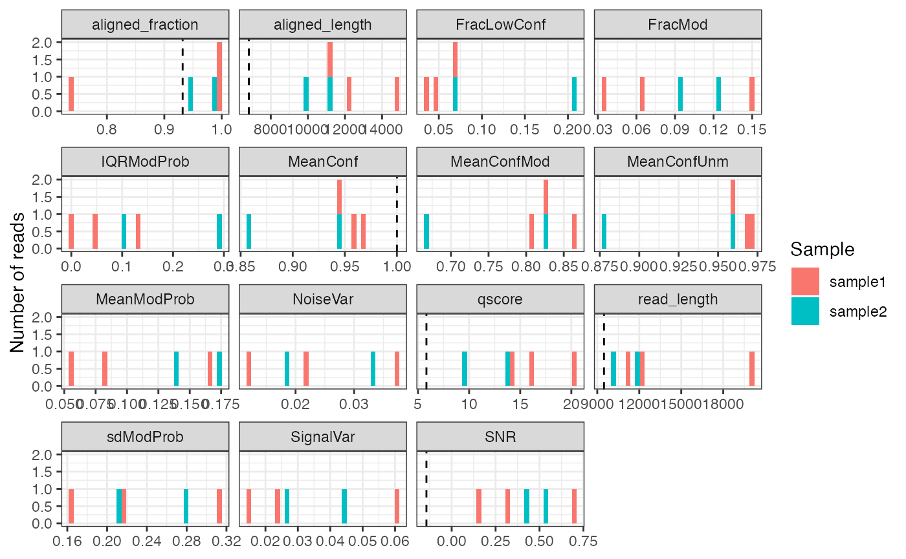

# SingleMoleculeGenomicsIO

## Overview

`SingleMoleculeGenomicsIO` provides tools for reading and processing
single-molecule genomics data in R. These include functions for reading
base modifications from `modBam` files, e.g. generated by
[Dorado](https://github.com/nanoporetech/dorado), or text files
generated by [modkit](https://nanoporetech.github.io/modkit), efficient
representation of such data as R objects, and functions to manipulate
and summarize such objects.

Current contributors include:

- [Panagiotis Papasaikas](https://github.com/ppapasaikas)
- [Sebastien Smallwood](https://github.com/smalseba)
- [Charlotte Soneson](https://github.com/csoneson)
- [Michael Stadler](https://github.com/mbstadler)

## Installation

`SingleMoleculeGenomicsIO` can be installed from GitHub via the
`BiocManager` package:

    if (!requireNamespace("BiocManager", quietly = TRUE))
        install.packages("BiocManager")

    BiocManager::install("fmicompbio/SingleMoleculeGenomicsIO")

## Load data

### Load read-level data

We start by loading single-molecule genomics data at the level of
individual reads (a small example dataset with 6mA modifications
representing accessibility). Read-level data is provided as a `modBam`
file (standard bam file with modification data stored in `MM` and `ML`
tags, see
[SAMtags.pdf](https://samtools.github.io/hts-specs/SAMtags.pdf)) and is
read using the
[`readModBam()`](https://fmicompbio.github.io/SingleMoleculeGenomicsIO/reference/readModBam.md)
function from `SingleMoleculeGenomicsIO`.

Alternatively, read-level modification data can also be extracted from
`modBam` files using [modkit](https://nanoporetech.github.io/modkit)
(see
[`readModkitExtract()`](https://fmicompbio.github.io/SingleMoleculeGenomicsIO/reference/readModkitExtract.md)
to read the output generated by `modkit extract`).

The small example `modBam` files contained in `SingleMoleculeGenomicsIO`
were generated using the
[Dorado](https://github.com/nanoporetech/dorado) aligner:

``` r
# load packages
library(SingleMoleculeGenomicsIO)
library(SummarizedExperiment)
library(Biostrings)
library(SparseArray)
library(BiocParallel)

# read-level 6mA data generated by 'dorado'
modbamfiles <- system.file("extdata",
                           c("6mA_1_10reads.bam", "6mA_2_10reads.bam"),
                            package = "SingleMoleculeGenomicsIO")
names(modbamfiles) <- c("sample1", "sample2")
```

Modification data is read from these files using
[`readModBam()`](https://fmicompbio.github.io/SingleMoleculeGenomicsIO/reference/readModBam.md):

``` r
se <- readModBam(bamfiles = modbamfiles,
                 regions = "chr1:6940000-7000000",
                 modbase = "a",
                 verbose = TRUE, 
                 BPPARAM = BiocParallel::SerialParam())
#> ℹ extracting base modifications from modBAM files
#> ℹ finding unique genomic positions...
#> ✔ finding unique genomic positions... [126ms]
#> 
#> ℹ collapsed 17739 positions to 7967 unique ones
#> ✔ collapsed 17739 positions to 7967 unique ones [535ms]
#> 
se
#> class: RangedSummarizedExperiment 
#> dim: 7967 2 
#> metadata(3): readLevelData variantPositions filteredOutReads
#> assays(1): mod_prob
#> rownames(7967): chr1:6925830:- chr1:6925834:- ... chr1:6941622:-
#>   chr1:6941631:-
#> rowData names(0):
#> colnames(2): sample1 sample2
#> colData names(4): sample modbase n_reads readInfo
```

This will create a `RangedSummarizedExperiment` object with positions in
rows:

``` r
# rows are positions...
rowRanges(se)
#> UnstitchedGPos object with 7967 positions and 0 metadata columns:
#>                  seqnames       pos strand
#>                     <Rle> <integer>  <Rle>
#>   chr1:6925830:-     chr1   6925830      -
#>   chr1:6925834:-     chr1   6925834      -
#>   chr1:6925836:-     chr1   6925836      -
#>   chr1:6925837:-     chr1   6925837      -
#>   chr1:6925841:-     chr1   6925841      -
#>              ...      ...       ...    ...
#>   chr1:6941611:-     chr1   6941611      -
#>   chr1:6941614:-     chr1   6941614      -
#>   chr1:6941620:-     chr1   6941620      -
#>   chr1:6941622:-     chr1   6941622      -
#>   chr1:6941631:-     chr1   6941631      -
#>   -------
#>   seqinfo: 1 sequence from an unspecified genome; no seqlengths
```

The columns of `se` correspond to samples:

``` r
# ... and columns are samples
colData(se)
#> DataFrame with 2 rows and 4 columns
#>              sample     modbase   n_reads
#>         <character> <character> <integer>
#> sample1     sample1           a         3
#> sample2     sample2           a         2
#>                                                                            readInfo
#>                                                                              <List>
#> sample1 14.1428:20058:14801:...,16.0127:11305:11214:...,20.3082:12277:12227:...,...
#> sample2                         9.67461:11834:11234:...,13.66480:10057:9898:...,...
```

The sample names in the `sample` column are obtained from the input
files (here `modbamfiles`), or if the files are not named will be
automatically assigned (using `"s1"`, `"s2"` and so on, assuming that
each file corresponds to a separate sample).

Read-level information is contained in a list under `readInfo`, with one
element per sample:

``` r
se$readInfo
#> List of length 2
#> names(2): sample1 sample2
```

Each sample typically contains several reads (see `se$n_reads`), which
correspond to the rows of `se$readInfo`, for example for `"sample1"`:

``` r
se$readInfo$sample1
#> DataFrame with 3 rows and 6 columns
#>                                                 qscore read_length
#>                                              <numeric>   <integer>
#> sample1-233e48a7-f379-4dcf-9270-958231125563   14.1428       20058
#> sample1-d52a5f6a-a60a-4f85-913e-eada84bfbfb9   16.0127       11305
#> sample1-92e906ae-cddb-4347-a114-bf9137761a8d   20.3082       12277
#>                                              aligned_length variant_label
#>                                                   <integer>   <character>
#> sample1-233e48a7-f379-4dcf-9270-958231125563          14801            NA
#> sample1-d52a5f6a-a60a-4f85-913e-eada84bfbfb9          11214            NA
#> sample1-92e906ae-cddb-4347-a114-bf9137761a8d          12227            NA
#>                                               ref_strand aligned_fraction
#>                                              <character>        <numeric>
#> sample1-233e48a7-f379-4dcf-9270-958231125563           -         0.737910
#> sample1-d52a5f6a-a60a-4f85-913e-eada84bfbfb9           -         0.991950
#> sample1-92e906ae-cddb-4347-a114-bf9137761a8d           -         0.995927
```

### Explore assay data

The single assay `mod_prob` is a `DataFrame` with modification
probabilities.

``` r
assayNames(se)
#> [1] "mod_prob"

m <- assay(se, "mod_prob")
m
#> DataFrame with 7967 rows and 2 columns
#>                          sample1    sample2
#>                       <NaMatrix> <NaMatrix>
#> chr1:6925830:-           0:NA:NA      NA:NA
#> chr1:6925834:-           0:NA:NA      NA:NA
#> chr1:6925836:-           0:NA:NA      NA:NA
#> chr1:6925837:-           0:NA:NA      NA:NA
#> chr1:6925841:- 0.275390625:NA:NA      NA:NA
#> ...                          ...        ...
#> chr1:6941611:- NA:NA:0.052734375      NA:NA
#> chr1:6941614:- NA:NA:0.130859375      NA:NA
#> chr1:6941620:- NA:NA:0.068359375      NA:NA
#> chr1:6941622:- NA:NA:0.060546875      NA:NA
#> chr1:6941631:- NA:NA:0.056640625      NA:NA
```

In order to store read-level data for variable numbers of reads per
sample, each sample column is not just a simple vector, but a
position-by-read `NaMatrix` (a sparse matrix object defined in the
[`SparseArray`](https://bioconductor.org/packages/SparseArray) package).

``` r
m$sample1
#> <7967 x 3 NaMatrix> of type "double" [nnacount=11300 (47%)]:
#>         sample1-233e48a7-f379-4dcf-9270-958231125563
#>    [1,]                                    0.0000000
#>    [2,]                                    0.0000000
#>    [3,]                                    0.0000000
#>    [4,]                                    0.0000000
#>    [5,]                                    0.2753906
#>     ...                                            .
#> [7963,]                                           NA
#> [7964,]                                           NA
#> [7965,]                                           NA
#> [7966,]                                           NA
#> [7967,]                                           NA
#>         sample1-d52a5f6a-a60a-4f85-913e-eada84bfbfb9
#>    [1,]                                           NA
#>    [2,]                                           NA
#>    [3,]                                           NA
#>    [4,]                                           NA
#>    [5,]                                           NA
#>     ...                                            .
#> [7963,]                                           NA
#> [7964,]                                           NA
#> [7965,]                                           NA
#> [7966,]                                           NA
#> [7967,]                                           NA
#>         sample1-92e906ae-cddb-4347-a114-bf9137761a8d
#>    [1,]                                           NA
#>    [2,]                                           NA
#>    [3,]                                           NA
#>    [4,]                                           NA
#>    [5,]                                           NA
#>     ...                                            .
#> [7963,]                                   0.05273438
#> [7964,]                                   0.13085938
#> [7965,]                                   0.06835938
#> [7966,]                                   0.06054688
#> [7967,]                                   0.05664062
```

If a ‘flat’ matrix is needed, in which columns correspond to reads
instead of samples, it can be created using
[`as.matrix()`](https://rdrr.io/r/base/matrix.html). Notice the number
of columns in each of the objects:

``` r
ncol(se)           # 2 samples
#> [1] 2
ncol(m$sample1)    # 3 reads in "sample1"
#> [1] 3
ncol(m$sample2)    # 2 reads in "sample2"
#> [1] 2
ncol(as.matrix(m)) # 5 reads in total
#> [1] 5
```

One advantage of the grouping of reads per sample is that you can easily
perform per-sample operations using `lapply` (returns a `list`) or
`endoapply` (returns a `DataFrame`):

``` r
lapply(m, ncol)
#> $sample1
#> [1] 3
#> 
#> $sample2
#> [1] 2
endoapply(m, ncol)
#> DataFrame with 1 row and 2 columns
#>     sample1   sample2
#>   <integer> <integer>
#> 1         3         2
```

The `NaMatrix` objects do not store `NA` values and thus use much less
memory compared to a normal (dense) matrix. The `NA` values here occur
at positions (rows) that are not covered by the read of that column, and
there are typically a large fraction of NA values:

``` r
prod(dim(m$sample1)) # total number of values
#> [1] 23901
nnacount(m$sample1)  # number of non-NA values
#> [1] 11300
```

**Important:** These `NA` values have to be excluded for example when
calculating the average modification probability for a position using
`mean(..., na.rm = TRUE)`, otherwise the result will be `NA` for all
incompletely covered positions:

``` r
# modification probabilities at position "chr1:6928850:-"
m["chr1:6928850:-", ]
#> DataFrame with 1 row and 2 columns
#>                                   sample1    sample2
#>                                <NaMatrix> <NaMatrix>
#> chr1:6928850:- 0.623046875:0.099609375:NA      NA:NA

# WRONG: take the mean of all values (including NAs)
lapply(m["chr1:6928850:-", ], mean)
#> $sample1
#> [1] NA
#> 
#> $sample2
#> [1] NA

# CORRECT: exclude the NA values (na.rm = TRUE)
lapply(m["chr1:6928850:-", ], mean, na.rm = TRUE)
#> $sample1
#> [1] 0.3613281
#> 
#> $sample2
#> [1] NaN
```

Note that for sample2, in which no read overlaps the selected position,
`mean(..., na.rm = TRUE)` returns `NaN`.

In most cases it is preferable to use the convenience functions in
`SingleMoleculeGenomicsIO`, such as
[`flattenReadLevelAssay()`](https://fmicompbio.github.io/SingleMoleculeGenomicsIO/reference/flattenReadLevelAssay.md)
(see next section), to calculate summaries over reads instead of the
`lapply(...)` used above for illustration.

### Summarize read-level data

Summarized data can be obtained from the read-level data by calculating
a per-position summary over the reads in each sample:

``` r
se_summary <- flattenReadLevelAssay(
    se, statistics = c("Nmod", "Nvalid", "FracMod", "Pmod", "AvgConf"))
```

As discussed above, this will correctly exclude non-observed values and
return zero values (for count assays `"Nmod"`, “`Nvalid`”) or `NaN` for
assays with fractions (`"FracMod"`, `"Pmod"` and `"AvgConf"`), for
positions without any observed data (see for example `"Pmod"` in
`"sample2"`):

``` r
assay(se_summary, "Pmod")["chr1:6928850:-", ]
#>   sample1   sample2 
#> 0.3613281       NaN
```

The summary statistics to calculate are selected using the `statistics`
argument. By default,
[`flattenReadLevelAssay()`](https://fmicompbio.github.io/SingleMoleculeGenomicsIO/reference/flattenReadLevelAssay.md)
will count the number of modified (`Nmod`) and total (`Nvalid`) reads at
each position and sample, and calculate the fraction of modified bases
from the two (`FracMod`).

``` r
assay(se_summary, "Nmod")["chr1:6928850:-", ]
#> sample1 sample2 
#>       1       0
assay(se_summary, "Nvalid")["chr1:6928850:-", ]
#> sample1 sample2 
#>       2       0
assay(se_summary, "FracMod")["chr1:6928850:-", ]
#> sample1 sample2 
#>     0.5     NaN
```

In the above example, we additionally calculate the average modification
probability (`Pmod`) and the average confidence of the modification
calls per position (`AvgConf`). As we have not changed the default
`keepReads = TRUE`, we keep the read-level assay from the input object
(`mod_prob`) in the returned object. Because of the grouping of reads by
sample in `mod_prob`, the dimensions of read-level or summary-level
objects remain identical:

``` r
# read-level data is retained in "mod_prob" assay
assayNames(se_summary)
#> [1] "mod_prob" "Nmod"     "Nvalid"   "FracMod"  "Pmod"     "AvgConf"

# ... which groups the reads by sample
assay(se_summary, "mod_prob")
#> DataFrame with 7967 rows and 2 columns
#>                          sample1    sample2
#>                       <NaMatrix> <NaMatrix>
#> chr1:6925830:-           0:NA:NA      NA:NA
#> chr1:6925834:-           0:NA:NA      NA:NA
#> chr1:6925836:-           0:NA:NA      NA:NA
#> chr1:6925837:-           0:NA:NA      NA:NA
#> chr1:6925841:- 0.275390625:NA:NA      NA:NA
#> ...                          ...        ...
#> chr1:6941611:- NA:NA:0.052734375      NA:NA
#> chr1:6941614:- NA:NA:0.130859375      NA:NA
#> chr1:6941620:- NA:NA:0.068359375      NA:NA
#> chr1:6941622:- NA:NA:0.060546875      NA:NA
#> chr1:6941631:- NA:NA:0.056640625      NA:NA

# the dimensions of  read-level `se` and summarized `se_summary` are identical
dim(se)
#> [1] 7967    2
dim(se_summary)
#> [1] 7967    2
```

### Load summary-level data

As illustrated above, summary-level data (e.g. average modification
fraction at each position) can be calculated from read-level data.
Alternatively, it can also be directly read from `modBam` files, which
is faster and reduces the size of the object in memory. In addition,
there are other file formats that only store summary-level data
(e.g. `bed` files) that can also be imported using
`SingleMoleculeGenomicsIO`.

#### Read summary-level data from `modBam` files

To read summary-level data with
[`readModBam()`](https://fmicompbio.github.io/SingleMoleculeGenomicsIO/reference/readModBam.md),
we set the `level` argument to `"summary"`:

``` r
se_summary2 <- readModBam(bamfiles = modbamfiles,
                          regions = "chr1:6940000-7000000",
                          modbase = "a",
                          level = "summary",
                          verbose = TRUE, 
                          BPPARAM = BiocParallel::SerialParam())
#> ℹ extracting base modifications from modBAM files
#> ℹ finding unique genomic positions...
#> ✔ finding unique genomic positions... [31ms]
#> 
#> ℹ collapsed 11211 positions to 7967 unique ones
#> ✔ collapsed 11211 positions to 7967 unique ones [87ms]
#> 
se_summary2
#> class: RangedSummarizedExperiment 
#> dim: 7967 2 
#> metadata(1): readLevelData
#> assays(3): Nmod Nvalid FracMod
#> rownames(7967): chr1:6925830:- chr1:6925834:- ... chr1:6941622:-
#>   chr1:6941631:-
#> rowData names(0):
#> colnames(2): sample1 sample2
#> colData names(2): sample modbase
```

Notice that `se_summary2` contains only summary-level assays (`Nmod`,
`Nvalid` and `FracMod`), and no read-level modifications anymore (assay
`mod_prob`). Otherwise, it resembles the read-level object `se`, for
example it covers the same genomic positions:

``` r
# rows are positions...
rowRanges(se)
#> UnstitchedGPos object with 7967 positions and 0 metadata columns:
#>                  seqnames       pos strand
#>                     <Rle> <integer>  <Rle>
#>   chr1:6925830:-     chr1   6925830      -
#>   chr1:6925834:-     chr1   6925834      -
#>   chr1:6925836:-     chr1   6925836      -
#>   chr1:6925837:-     chr1   6925837      -
#>   chr1:6925841:-     chr1   6925841      -
#>              ...      ...       ...    ...
#>   chr1:6941611:-     chr1   6941611      -
#>   chr1:6941614:-     chr1   6941614      -
#>   chr1:6941620:-     chr1   6941620      -
#>   chr1:6941622:-     chr1   6941622      -
#>   chr1:6941631:-     chr1   6941631      -
#>   -------
#>   seqinfo: 1 sequence from an unspecified genome; no seqlengths
rowRanges(se_summary2)
#> UnstitchedGPos object with 7967 positions and 0 metadata columns:
#>                  seqnames       pos strand
#>                     <Rle> <integer>  <Rle>
#>   chr1:6925830:-     chr1   6925830      -
#>   chr1:6925834:-     chr1   6925834      -
#>   chr1:6925836:-     chr1   6925836      -
#>   chr1:6925837:-     chr1   6925837      -
#>   chr1:6925841:-     chr1   6925841      -
#>              ...      ...       ...    ...
#>   chr1:6941611:-     chr1   6941611      -
#>   chr1:6941614:-     chr1   6941614      -
#>   chr1:6941620:-     chr1   6941620      -
#>   chr1:6941622:-     chr1   6941622      -
#>   chr1:6941631:-     chr1   6941631      -
#>   -------
#>   seqinfo: 1 sequence from an unspecified genome; no seqlengths
```

The summary-level assays generated from `se` (see `se_summary` above)
are also identical to the ones directly read from the `modBam` file into
`se_summary2`:

``` r
identical(assay(se_summary, "Nvalid"),
          assay(se_summary2, "Nvalid"))
#> [1] TRUE
```

#### Read summary-level data from `bedMethyl` files

As mentioned, summary-level data can also be imported from `bedMethyl`
files that contain total and methylated counts for individual
positions::

``` r
# collapsed 5mC data for a small genomic window in bedMethyl format
bedmethylfiles <- system.file("extdata",
                              c("modkit_pileup_5mC_1.bed.gz",
                                "modkit_pileup_5mC_2.bed.gz"),
                              package = "SingleMoleculeGenomicsIO")

# file with sequence of the reference genome in fasta format
reffile <- system.file("extdata", "reference.fa.gz",
                       package = "SingleMoleculeGenomicsIO")
```

As these `bedMethyl` files represent 5mC modifications, we set
`modbase = "m"` in the
[`readBedMethyl()`](https://fmicompbio.github.io/SingleMoleculeGenomicsIO/reference/readBedMethyl.md)
call (the same could be done in `readModBam` to load `modBam` files
representing 5mC modifications). For a full list of possible
modifications see the section about base modifications in the [SAM tag
specification](https://samtools.github.io/hts-specs/SAMtags.pdf)). We
also provide a sequence reference (genome sequence) from which to
extract the sequence context for each position.

``` r
names(bedmethylfiles) <- c("sample1", "sample2")
se_bed <- readBedMethyl(bedmethylfiles,
                        modbase = "m",
                        sequenceContextWidth = 3,
                        sequenceReference = reffile, 
                        BPPARAM = BiocParallel::SerialParam())
se_bed
#> class: RangedSummarizedExperiment 
#> dim: 12020 2 
#> metadata(1): readLevelData
#> assays(2): Nmod Nvalid
#> rownames: NULL
#> rowData names(1): sequenceContext
#> colnames(2): sample1 sample2
#> colData names(2): sample modbase
```

As before, the summarized data is read into a
`RangedSummarizedExperiment` object, with rows corresponding to genomic
positions:

``` r
rowRanges(se_bed)
#> UnstitchedGPos object with 12020 positions and 1 metadata column:
#>           seqnames       pos strand | sequenceContext
#>              <Rle> <integer>  <Rle> |  <DNAStringSet>
#>       [1]     chr1   6937685      - |             GCT
#>       [2]     chr1   6937686      + |             GCA
#>       [3]     chr1   6937688      + |             ACT
#>       [4]     chr1   6937689      + |             CTT
#>       [5]     chr1   6937690      - |             TAA
#>       ...      ...       ...    ... .             ...
#>   [12016]     chr1   6957051      - |             CCT
#>   [12017]     chr1   6957052      - |             TCC
#>   [12018]     chr1   6957054      + |             AAA
#>   [12019]     chr1   6957056      - |             CCT
#>   [12020]     chr1   6957057      - |             CCC
#>   -------
#>   seqinfo: 1 sequence from an unspecified genome; no seqlengths
```

… and the columns correspond to the different samples (here
corresponding to the names of the two input files in `bedmethylfiles`):

``` r
colnames(se_bed)
#> [1] "sample1" "sample2"
```

The data is stored in two matrices (assays) called `Nmod` (the number of
modified bases per sample and position) and `Nvalid` (the number of
valid total read covering that position in each sample):

``` r
assayNames(se_bed)
#> [1] "Nmod"   "Nvalid"

head(assay(se_bed, "Nmod"))
#>      sample1 sample2
#> [1,]       6       0
#> [2,]       1       5
#> [3,]       1       0
#> [4,]       0       0
#> [5,]       0       0
#> [6,]       0       0
head(assay(se_bed, "Nvalid"))
#>      sample1 sample2
#> [1,]      15       0
#> [2,]      16      15
#> [3,]      16      15
#> [4,]       0       1
#> [5,]       0       1
#> [6,]       1       0
```

From these, we can easily calculate the fraction of modifications:

``` r
fraction_modified <- assay(se_bed, "Nmod") / assay(se_bed, "Nvalid")
head(fraction_modified)
#>      sample1   sample2
#> [1,]  0.4000       NaN
#> [2,]  0.0625 0.3333333
#> [3,]  0.0625 0.0000000
#> [4,]     NaN 0.0000000
#> [5,]     NaN 0.0000000
#> [6,]  0.0000       NaN
```

As before, non-finite fractions result from positions that had zero
coverage in a given sample.

### Load data for a random subset of the reads

By default,
[`readModBam()`](https://fmicompbio.github.io/SingleMoleculeGenomicsIO/reference/readModBam.md)
will load all reads overlapping the regions indicated by the `regions`
argument. However, it is also possible to load a random subset of reads
(this can be useful e.g. to calculate distributions of quality scores,
using reads aligning to different parts of the genome but without the
need to load the entire `modBam` file into R).

``` r
se_sample <- readModBam(bamfiles = modbamfiles, 
                        modbase = "a", 
                        nAlnsToSample = 5, 
                        seqnamesToSampleFrom = "chr1", 
                        verbose = TRUE, 
                        BPPARAM = BiocParallel::SerialParam(RNGseed = 1327828L))
#> ℹ extracting base modifications from modBAM files
#> ℹ opening input file /Users/runner/work/_temp/Library/SingleMoleculeGenomicsIO/extdata/6mA_1_10reads.bam using 1 thread
#> ℹ sampling alignments with probability 0.5
#> ℹ reading alignments overlapping 1 region
#>  ■■■■■■■                           20% |  ETA:  0s
#>  ■■■■■■■■■■■■■■■■■■■■■■■■■■■■■■■  100% |  ETA:  0s
#> 
#> ℹ removed 150 unaligned (e.g. soft-masked) of 41618 called bases
#> ℹ read 5 alignments
#> ℹ opening input file /Users/runner/work/_temp/Library/SingleMoleculeGenomicsIO/extdata/6mA_2_10reads.bam using 1 thread
#> ℹ sampling alignments with probability 0.5
#> ℹ reading alignments overlapping 1 region
#> ℹ removed 1165 unaligned (e.g. soft-masked) of 80587 called bases
#> ℹ read 7 alignments
#> ℹ finding unique genomic positions...
#> ✔ finding unique genomic positions... [32ms]
#> 
#> ℹ collapsed 31912 positions to 7238 unique ones
#> ✔ collapsed 31912 positions to 7238 unique ones [412ms]
#> 
se_sample$n_reads
#> [1] 5 7
```

Note that the exact number of sampled reads may not be identical to the
requested number. One reason for this is that the requested number is
combined with the total number of alignments to calculate the fraction
of reads to be sampled (in this small case, 0.5), and each alignment
will be retained with this probability.

## Expand the `SummarizedExperiment` object to single base resolution

The objects returned by the reading functions above contain data only
for the positions with an observable modification state for the given
modbase. For cases where a single nucleotide resolution is required
(i.e., where the rows in the object must cover each position within a
region), the `expandSEToBaseSpace` will return a suitable object. Note
that any strand information in the original positions will be ignored.

``` r
se_expand <- expandSEToBaseSpace(se)
dim(se_expand)
#> [1] 15802     2
```

## Add quality scores and filter `SummarizedExperiment` object

`SingleMoleculeGenomicsIO` provides functionality to calculate a variety
of statistics for individual reads. The results will be added as a new
column in the `colData` of the `SummarizedExperiment`.

``` r
# start from read-level data
# ... some read-level statistics were added already when reading the data
se$readInfo$sample1
#> DataFrame with 3 rows and 6 columns
#>                                                 qscore read_length
#>                                              <numeric>   <integer>
#> sample1-233e48a7-f379-4dcf-9270-958231125563   14.1428       20058
#> sample1-d52a5f6a-a60a-4f85-913e-eada84bfbfb9   16.0127       11305
#> sample1-92e906ae-cddb-4347-a114-bf9137761a8d   20.3082       12277
#>                                              aligned_length variant_label
#>                                                   <integer>   <character>
#> sample1-233e48a7-f379-4dcf-9270-958231125563          14801            NA
#> sample1-d52a5f6a-a60a-4f85-913e-eada84bfbfb9          11214            NA
#> sample1-92e906ae-cddb-4347-a114-bf9137761a8d          12227            NA
#>                                               ref_strand aligned_fraction
#>                                              <character>        <numeric>
#> sample1-233e48a7-f379-4dcf-9270-958231125563           -         0.737910
#> sample1-d52a5f6a-a60a-4f85-913e-eada84bfbfb9           -         0.991950
#> sample1-92e906ae-cddb-4347-a114-bf9137761a8d           -         0.995927

# ... calculate additional read statistics
se <- addReadStats(se, name = "QC", 
                   BPPARAM = SerialParam())
#> Warning: Too few points to estimate noise floor (1); raw noise variances
#> are used.
#> Warning: Too few points to estimate noise floor (0); raw noise variances
#> are used.
se$QC$sample1
#> DataFrame with 3 rows and 13 columns
#>                                              MeanModProb   FracMod  MeanConf
#>                                                <numeric> <numeric> <numeric>
#> sample1-233e48a7-f379-4dcf-9270-958231125563   0.1652868 0.1498969  0.943914
#> sample1-d52a5f6a-a60a-4f85-913e-eada84bfbfb9   0.0835376 0.0646707  0.958320
#> sample1-92e906ae-cddb-4347-a114-bf9137761a8d   0.0556013 0.0347512  0.965854
#>                                              MeanConfUnm MeanConfMod
#>                                                <numeric>   <numeric>
#> sample1-233e48a7-f379-4dcf-9270-958231125563    0.957961    0.864255
#> sample1-d52a5f6a-a60a-4f85-913e-eada84bfbfb9    0.967633    0.823622
#> sample1-92e906ae-cddb-4347-a114-bf9137761a8d    0.971512    0.808703
#>                                              FracLowConf IQRModProb sdModProb
#>                                                <numeric>  <numeric> <numeric>
#> sample1-233e48a7-f379-4dcf-9270-958231125563   0.0680724  0.1308594  0.312860
#> sample1-d52a5f6a-a60a-4f85-913e-eada84bfbfb9   0.0470060  0.0488281  0.215142
#> sample1-92e906ae-cddb-4347-a114-bf9137761a8d   0.0355852  0.0000000  0.164023
#>                                                                            ACModProb
#>                                                                               <list>
#> sample1-233e48a7-f379-4dcf-9270-958231125563       0.1306906,0.0840176,0.0591518,...
#> sample1-d52a5f6a-a60a-4f85-913e-eada84bfbfb9       0.0619512,0.0479904,0.0392903,...
#> sample1-92e906ae-cddb-4347-a114-bf9137761a8d -0.00193260,-0.01562365,-0.00424019,...
#>                                                                           PACModProb
#>                                                                               <list>
#> sample1-233e48a7-f379-4dcf-9270-958231125563    -0.0415954,-0.0216324,-0.0132802,...
#> sample1-d52a5f6a-a60a-4f85-913e-eada84bfbfb9 -0.00443190,-0.00209608,-0.00710440,...
#> sample1-92e906ae-cddb-4347-a114-bf9137761a8d -0.01637500, 0.00794205,-0.02053895,...
#>                                                    SNR SignalVar  NoiseVar
#>                                              <numeric> <numeric> <numeric>
#> sample1-233e48a7-f379-4dcf-9270-958231125563  0.698999 0.0605703 0.0373113
#> sample1-d52a5f6a-a60a-4f85-913e-eada84bfbfb9  0.154130 0.0243781 0.0219079
#> sample1-92e906ae-cddb-4347-a114-bf9137761a8d  0.307366 0.0148793 0.0120242
```

The distribution of the quality statistics can also be plotted, which is
often helpful in order to decide on cutoffs for downstream analysis.
Note that in the current example data, each sample contains only a few
reads and hence the plot below is very sparse.

``` r
plotReadStats(se, readInfoCol = "readInfo", qcCol = "QC")
```



The
[`filterReads()`](https://fmicompbio.github.io/SingleMoleculeGenomicsIO/reference/filterReads.md)
function can be used to filter the set of reads based on various quality
indicators. This step requires that the read statistics that will be
used for the filtering have been calculated as indicated above.

``` r
se_filtreads <- filterReads(se, readInfoCol = "readInfo",
                            qcCol = "QC", minQscore = 10, 
                            minAlignedFraction = 0.8)
# number of retained reads for each sample
lapply(assay(se_filtreads, "mod_prob"), ncol)
#> $sample1
#> [1] 2
#> 
#> $sample2
#> [1] 1
# tables with the reason behind each filtered read
metadata(se_filtreads)$filteredOutReads
#> $sample1
#> <1 x 9 SparseMatrix> of type "logical" [nzcount=1 (11%)]:
#>                                               Qscore Entropy ...   AllNA
#> sample1-233e48a7-f379-4dcf-9270-958231125563   FALSE   FALSE   .   FALSE
#> 
#> $sample2
#> <1 x 9 SparseMatrix> of type "logical" [nzcount=1 (11%)]:
#>                                               Qscore Entropy ...   AllNA
#> sample2-034b625e-6230-4f8d-a713-3a32cd96c298    TRUE   FALSE   .   FALSE
```

It is also possible to filter out positions (rows), based on a variety
of criteria, using the
[`filterPositions()`](https://fmicompbio.github.io/SingleMoleculeGenomicsIO/reference/filterPositions.md)
function. Typical filter criteria include the sequence context of the
observation and the read coverage.

In order to filter by sequence context, we first need to add it to our
object (if this was not already done when the data was imported). This
can be done using the
[`addSeqContext()`](https://fmicompbio.github.io/SingleMoleculeGenomicsIO/reference/addSeqContext.md)
function. We can extract sequence contexts of arbitrary width, based on
a provided genome reference.

``` r
gnm <- readDNAStringSet(system.file("extdata",
                                    "reference.fa.gz",
                                    package = "SingleMoleculeGenomicsIO"))
se <- addSeqContext(se, sequenceContextWidth = 1, sequenceReference = gnm)
```

Next, we can filter the object to only contain positions where the
annotated nucleotide at the corresponding genomic position is an `A`.
Any IUPAC code can be used - for example, `NCG` would match
trinucleotide contexts with a central C followed by a G (and preceded by
any base).

``` r
# check sequence context distribution across observations
table(as.character(rowData(se)$sequenceContext))
#> 
#>    A    C    G    T 
#> 7556   86  284   41

se_posfilt <- filterPositions(se, filters = "sequenceContext", 
                              sequenceContext = "A")
dim(se_posfilt)
#> [1] 7556    2
# check that the sequence context of all retained positions is A
table(as.character(rowData(se_posfilt)$sequenceContext))
#> 
#>    A 
#> 7556
```

## Subset and regroup reads

After importing read-level data with `SingleMoleculeGenomicsIO`, the set
of reads can be subset using the
[`subsetReads()`](https://fmicompbio.github.io/SingleMoleculeGenomicsIO/reference/subsetReads.md)
function. The subsetting can be done either by specifying the read names
or indices to retain, or by asking for a random subset of reads.

``` r
# subset to only the first two reads per sample
(reads_to_keep <- lapply(assay(se, "mod_prob"), function(s) 1:2))
#> $sample1
#> [1] 1 2
#> 
#> $sample2
#> [1] 1 2
se_subset <- subsetReads(se, reads = reads_to_keep)
lapply(assay(se_subset, "mod_prob"), ncol)
#> $sample1
#> [1] 2
#> 
#> $sample2
#> [1] 2

# subset to specified reads
(reads_to_keep <- unlist(lapply(assay(se, "mod_prob"), function(s) colnames(s)[c(1, 2)])))
#>                                       sample11 
#> "sample1-233e48a7-f379-4dcf-9270-958231125563" 
#>                                       sample12 
#> "sample1-d52a5f6a-a60a-4f85-913e-eada84bfbfb9" 
#>                                       sample21 
#> "sample2-034b625e-6230-4f8d-a713-3a32cd96c298" 
#>                                       sample22 
#> "sample2-d03efe3b-a45b-430b-9cb6-7e5882e4faf8"
se_subset <- subsetReads(se, reads = reads_to_keep)
lapply(assay(se_subset, "mod_prob"), ncol)
#> $sample1
#> [1] 2
#> 
#> $sample2
#> [1] 2

# request a random set of two reads per sample
se_subset <- subsetReads(se, randomSubset = 2)
lapply(assay(se_subset, "mod_prob"), ncol)
#> $sample1
#> [1] 2
#> 
#> $sample2
#> [1] 2
```

See
[`?subsetReads`](https://fmicompbio.github.io/SingleMoleculeGenomicsIO/reference/subsetReads.md)
for more subsetting options.

In some situations, a *regrouping* of the reads is more suitable than a
subsetting. By default, the reads will be grouped by the sample they
originate from (i.e., each column in the `SummarizedExperiment`
corresponds to a sample). The
[`regroupReads()`](https://fmicompbio.github.io/SingleMoleculeGenomicsIO/reference/regroupReads.md)
and
[`regroupReadsByColData()`](https://fmicompbio.github.io/SingleMoleculeGenomicsIO/reference/regroupReads.md)
functions allow us to reorganize the reads in such a way that each
column of the object instead corresponds to another read property (e.g.,
the strand from which the read originates). The new groups can be
defined manually as a named list of read identifiers (for
[`regroupReads()`](https://fmicompbio.github.io/SingleMoleculeGenomicsIO/reference/regroupReads.md)),
or be generated automatically from a categorical column in the
read-level column annotations (for
[`regroupReadsByColData()`](https://fmicompbio.github.io/SingleMoleculeGenomicsIO/reference/regroupReads.md)).
Here we illustrate how to regroup the reads by the strand.

``` r
# read strand is stored in the column annotations (ref_strand)
se$readInfo$sample1
#> DataFrame with 3 rows and 6 columns
#>                                                 qscore read_length
#>                                              <numeric>   <integer>
#> sample1-233e48a7-f379-4dcf-9270-958231125563   14.1428       20058
#> sample1-d52a5f6a-a60a-4f85-913e-eada84bfbfb9   16.0127       11305
#> sample1-92e906ae-cddb-4347-a114-bf9137761a8d   20.3082       12277
#>                                              aligned_length variant_label
#>                                                   <integer>   <character>
#> sample1-233e48a7-f379-4dcf-9270-958231125563          14801            NA
#> sample1-d52a5f6a-a60a-4f85-913e-eada84bfbfb9          11214            NA
#> sample1-92e906ae-cddb-4347-a114-bf9137761a8d          12227            NA
#>                                               ref_strand aligned_fraction
#>                                              <character>        <numeric>
#> sample1-233e48a7-f379-4dcf-9270-958231125563           -         0.737910
#> sample1-d52a5f6a-a60a-4f85-913e-eada84bfbfb9           -         0.991950
#> sample1-92e906ae-cddb-4347-a114-bf9137761a8d           -         0.995927

# regroup reads by strand, ignoring the sample information
se_regroup <- regroupReadsByColData(se, colNames = "ref_strand", 
                                    withinSample = FALSE)
colnames(se_regroup)
#> [1] "-" "+"

# regroup reads by strand, within each sample
se_regroup <- regroupReadsByColData(se, colNames = "ref_strand", 
                                    withinSample = TRUE)
colnames(se_regroup)
#> [1] "sample1--" "sample2--" "sample2-+"
```

## Add read segment annotations

Read segment annotation allow us to store information about specific
subregions of reads. These could, for example, represent inferred
locations of nucleosomes or transcription factor binding sites. The
segments need to be provided as a list of `IRangesList` objects (one per
sample), with each element of an `IRangesList` providing the annotations
for one read.

``` r
# define segments
segs <- list(sample1 = IRangesList(
    "sample1-d52a5f6a-a60a-4f85-913e-eada84bfbfb9" = IRanges(
        start = 6925834, width = 140),
    "sample1-233e48a7-f379-4dcf-9270-958231125563" = IRanges(
        start = c(6926000, 6926200), width = 140)), 
    sample2 = IRangesList())

# add segment annotation to se
se <- annotateReadSegments(se, irlList = segs, name = "nucl")
se$nucl
#> $sample1
#> IRangesList object of length 3:
#> $`sample1-233e48a7-f379-4dcf-9270-958231125563`
#> IRanges object with 2 ranges and 0 metadata columns:
#>           start       end     width
#>       <integer> <integer> <integer>
#>   [1]   6926000   6926139       140
#>   [2]   6926200   6926339       140
#> 
#> $`sample1-d52a5f6a-a60a-4f85-913e-eada84bfbfb9`
#> IRanges object with 1 range and 0 metadata columns:
#>           start       end     width
#>       <integer> <integer> <integer>
#>   [1]   6925834   6925973       140
#> 
#> $`sample1-92e906ae-cddb-4347-a114-bf9137761a8d`
#> IRanges object with 0 ranges and 0 metadata columns:
#>        start       end     width
#>    <integer> <integer> <integer>
#> 
#> 
#> $sample2
#> IRangesList object of length 2:
#> $`sample2-034b625e-6230-4f8d-a713-3a32cd96c298`
#> IRanges object with 0 ranges and 0 metadata columns:
#>        start       end     width
#>    <integer> <integer> <integer>
#> 
#> $`sample2-d03efe3b-a45b-430b-9cb6-7e5882e4faf8`
#> IRanges object with 0 ranges and 0 metadata columns:
#>        start       end     width
#>    <integer> <integer> <integer>
```

## Count state pairs

The import functions exemplified above all return a
`SummarizedExperiment` object with read- and/or summary-level data. For
certain applications, other data representations are more suitable. The
[`countStatePairs()`](https://fmicompbio.github.io/SingleMoleculeGenomicsIO/reference/countStatePairs.md)
function allows us to parse a `modBam` file and tabulate the number of
pairs of bases at a given distance and with a given combination of
modification states.

``` r
sp <- countStatePairs(bamfile = modbamfiles[1], 
                      modbase = "a", 
                      windowSize = 200, 
                      BPPARAM = BiocParallel::SerialParam(), 
                      verbose = FALSE)
sp
#> DataFrame with 200 rows and 5 columns
#>             S unmod_unmod unmod_mod mod_unmod   mod_mod
#>     <integer>   <numeric> <numeric> <numeric> <numeric>
#> 1           1       27084         0         0      2461
#> 2           2        8877       281       340       408
#> 3           3        9131       441       439       264
#> 4           4        8140       399       403       282
#> 5           5        8565       485       493       164
#> ...       ...         ...       ...       ...       ...
#> 196       196        7289       578       572       114
#> 197       197        7351       589       590       123
#> 198       198        7566       635       591       140
#> 199       199        7491       624       565       129
#> 200       200        7377       580       575       119
```

## Session info

``` r
sessioninfo::session_info()
#> ─ Session info ───────────────────────────────────────────────────────────────
#>  setting  value
#>  version  R Under development (unstable) (2026-01-12 r89299)
#>  os       macOS Sequoia 15.7.3
#>  system   aarch64, darwin20
#>  ui       X11
#>  language en
#>  collate  en_US.UTF-8
#>  ctype    en_US.UTF-8
#>  tz       UTC
#>  date     2026-01-15
#>  pandoc   3.1.11 @ /usr/local/bin/ (via rmarkdown)
#>  quarto   NA
#> 
#> ─ Packages ───────────────────────────────────────────────────────────────────
#>  package                  * version    date (UTC) lib source
#>  abind                    * 1.4-8      2024-09-12 [1] CRAN (R 4.6.0)
#>  Biobase                  * 2.71.0     2025-11-12 [1] Bioconductor 3.23 (R 4.6.0)
#>  BiocGenerics             * 0.57.0     2025-11-13 [1] Bioconductor 3.23 (R 4.6.0)
#>  BiocIO                     1.21.0     2025-11-12 [1] Bioconductor 3.23 (R 4.6.0)
#>  BiocParallel             * 1.45.0     2025-11-12 [1] Bioconductor 3.23 (R 4.6.0)
#>  Biostrings               * 2.79.4     2026-01-07 [1] Bioconductor 3.23 (R 4.6.0)
#>  bitops                     1.0-9      2024-10-03 [1] CRAN (R 4.6.0)
#>  BSgenome                   1.79.1     2025-11-04 [1] Bioconductor 3.23 (R 4.6.0)
#>  bslib                      0.9.0      2025-01-30 [1] CRAN (R 4.6.0)
#>  cachem                     1.1.0      2024-05-16 [1] CRAN (R 4.6.0)
#>  cigarillo                  1.1.0      2025-11-12 [1] Bioconductor 3.23 (R 4.6.0)
#>  cli                        3.6.5      2025-04-23 [1] CRAN (R 4.6.0)
#>  codetools                  0.2-20     2024-03-31 [2] CRAN (R 4.6.0)
#>  crayon                     1.5.3      2024-06-20 [1] CRAN (R 4.6.0)
#>  curl                       7.0.0      2025-08-19 [1] CRAN (R 4.6.0)
#>  data.table                 1.17.8     2025-07-10 [1] CRAN (R 4.6.0)
#>  DelayedArray               0.37.0     2025-11-13 [1] Bioconductor 3.23 (R 4.6.0)
#>  desc                       1.4.3      2023-12-10 [1] CRAN (R 4.6.0)
#>  digest                     0.6.39     2025-11-19 [1] CRAN (R 4.6.0)
#>  dplyr                      1.1.4      2023-11-17 [1] CRAN (R 4.6.0)
#>  evaluate                   1.0.5      2025-08-27 [1] CRAN (R 4.6.0)
#>  farver                     2.1.2      2024-05-13 [1] CRAN (R 4.6.0)
#>  fastmap                    1.2.0      2024-05-15 [1] CRAN (R 4.6.0)
#>  fs                         1.6.6      2025-04-12 [1] CRAN (R 4.6.0)
#>  generics                 * 0.1.4      2025-05-09 [1] CRAN (R 4.6.0)
#>  GenomicAlignments          1.47.0     2025-10-31 [1] Bioconductor 3.23 (R 4.6.0)
#>  GenomicRanges            * 1.63.1     2025-12-08 [1] Bioconductor 3.23 (R 4.6.0)
#>  ggplot2                    4.0.1      2025-11-14 [1] CRAN (R 4.6.0)
#>  glue                       1.8.0      2024-09-30 [1] CRAN (R 4.6.0)
#>  gtable                     0.3.6      2024-10-25 [1] CRAN (R 4.6.0)
#>  htmltools                  0.5.8.1    2024-04-04 [1] CRAN (R 4.6.0)
#>  httr                       1.4.7      2023-08-15 [1] CRAN (R 4.6.0)
#>  IRanges                  * 2.45.0     2025-11-12 [1] Bioconductor 3.23 (R 4.6.0)
#>  jquerylib                  0.1.4      2021-04-26 [1] CRAN (R 4.6.0)
#>  jsonlite                   2.0.0      2025-03-27 [1] CRAN (R 4.6.0)
#>  knitr                      1.50       2025-03-16 [1] CRAN (R 4.6.0)
#>  labeling                   0.4.3      2023-08-29 [1] CRAN (R 4.6.0)
#>  lattice                    0.22-7     2025-04-02 [2] CRAN (R 4.6.0)
#>  lifecycle                  1.0.4      2023-11-07 [1] CRAN (R 4.6.0)
#>  magrittr                   2.0.4      2025-09-12 [1] CRAN (R 4.6.0)
#>  Matrix                   * 1.7-4      2025-08-28 [2] CRAN (R 4.6.0)
#>  MatrixGenerics           * 1.23.0     2025-11-12 [1] Bioconductor 3.23 (R 4.6.0)
#>  matrixStats              * 1.5.0      2025-01-07 [1] CRAN (R 4.6.0)
#>  pillar                     1.11.1     2025-09-17 [1] CRAN (R 4.6.0)
#>  pkgconfig                  2.0.3      2019-09-22 [1] CRAN (R 4.6.0)
#>  pkgdown                    2.2.0.9000 2025-12-03 [1] Github (r-lib/pkgdown@c07d935)
#>  purrr                      1.2.0      2025-11-04 [1] CRAN (R 4.6.0)
#>  R.methodsS3                1.8.2      2022-06-13 [1] CRAN (R 4.6.0)
#>  R.oo                       1.27.1     2025-05-02 [1] CRAN (R 4.6.0)
#>  R.utils                    2.13.0     2025-02-24 [1] CRAN (R 4.6.0)
#>  R6                         2.6.1      2025-02-15 [1] CRAN (R 4.6.0)
#>  ragg                       1.5.0      2025-09-02 [1] CRAN (R 4.6.0)
#>  RColorBrewer               1.1-3      2022-04-03 [1] CRAN (R 4.6.0)
#>  Rcpp                       1.1.0      2025-07-02 [1] CRAN (R 4.6.0)
#>  RCurl                      1.98-1.17  2025-03-22 [1] CRAN (R 4.6.0)
#>  restfulr                   0.0.16     2025-06-27 [1] CRAN (R 4.6.0)
#>  rjson                      0.2.23     2024-09-16 [1] CRAN (R 4.6.0)
#>  rlang                      1.1.6      2025-04-11 [1] CRAN (R 4.6.0)
#>  rmarkdown                  2.30       2025-09-28 [1] CRAN (R 4.6.0)
#>  Rsamtools                  2.27.0     2025-10-31 [1] Bioconductor 3.23 (R 4.6.0)
#>  rtracklayer                1.71.3     2025-12-14 [1] Bioconductor 3.23 (R 4.6.0)
#>  S4Arrays                 * 1.11.1     2026-01-15 [1] Github (Bioconductor/S4Arrays@b7ddb8c)
#>  S4Vectors                * 0.49.0     2025-11-12 [1] Bioconductor 3.23 (R 4.6.0)
#>  S7                         0.2.1      2025-11-14 [1] CRAN (R 4.6.0)
#>  sass                       0.4.10     2025-04-11 [1] CRAN (R 4.6.0)
#>  scales                     1.4.0      2025-04-24 [1] CRAN (R 4.6.0)
#>  Seqinfo                  * 1.1.0      2025-11-12 [1] Bioconductor 3.23 (R 4.6.0)
#>  sessioninfo                1.2.3      2025-02-05 [1] CRAN (R 4.6.0)
#>  SingleMoleculeGenomicsIO * 0.1.0      2026-01-15 [1] Bioconductor
#>  SparseArray              * 1.11.10    2026-01-15 [1] Github (Bioconductor/SparseArray@fa5a507)
#>  SummarizedExperiment     * 1.41.0     2025-10-31 [1] Bioconductor 3.23 (R 4.6.0)
#>  systemfonts                1.3.1      2025-10-01 [1] CRAN (R 4.6.0)
#>  textshaping                1.0.4      2025-10-10 [1] CRAN (R 4.6.0)
#>  tibble                     3.3.0      2025-06-08 [1] CRAN (R 4.6.0)
#>  tidyr                      1.3.1      2024-01-24 [1] CRAN (R 4.6.0)
#>  tidyselect                 1.2.1      2024-03-11 [1] CRAN (R 4.6.0)
#>  vctrs                      0.6.5      2023-12-01 [1] CRAN (R 4.6.0)
#>  withr                      3.0.2      2024-10-28 [1] CRAN (R 4.6.0)
#>  xfun                       0.54       2025-10-30 [1] CRAN (R 4.6.0)
#>  XML                        3.99-0.20  2025-11-08 [1] CRAN (R 4.6.0)
#>  XVector                  * 0.51.0     2025-11-12 [1] Bioconductor 3.23 (R 4.6.0)
#>  yaml                       2.3.10     2024-07-26 [1] CRAN (R 4.6.0)
#> 
#>  [1] /Users/runner/work/_temp/Library
#>  [2] /Library/Frameworks/R.framework/Versions/4.6-arm64/Resources/library
#>  * ── Packages attached to the search path.
#> 
#> ──────────────────────────────────────────────────────────────────────────────
```
